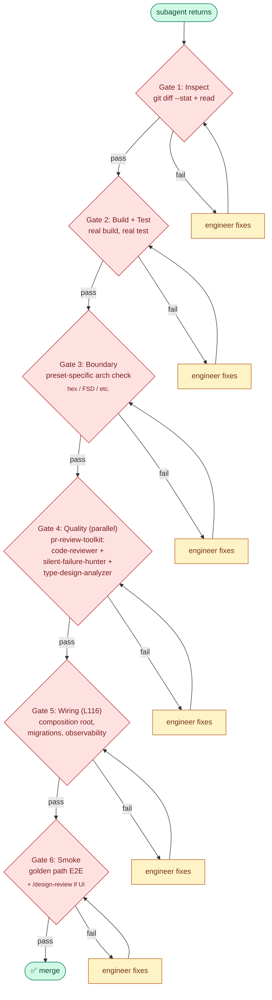
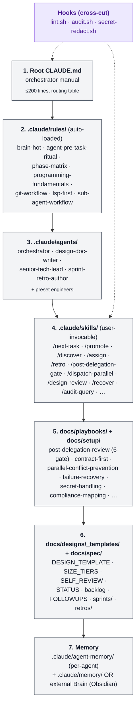

# AI-Workflows

A portable **AI control-plane template** for Claude Code projects. Lifted from
two production codebases (`idip-platform`, `aggegator`) that share the same
layered system of `CLAUDE.md` files, specialized subagents, user-invocable
skills, mechanical rule maps, design-doc templates, and a sprint/backlog
workflow.

Run one script and your new project starts with the same battle-tested
infrastructure — no re-building from scratch.

## The workflow at a glance

The control plane drives a feature from **idea → ship → retro** through
6 stages. Each stage produces a single artifact, and the next stage
can't start until the previous artifact lands.

```mermaid
flowchart LR
    Idea([💡 feature idea])
    Discovery["🔍 /discover<br/><sub>D### discovery doc</sub>"]
    Promote["📥 /promote<br/><sub>backlog row</sub>"]
    Next["📋 /next-task<br/><sub>orchestrator picks task</sub>"]
    Design["📐 design-doc-writer<br/><sub>D### design doc<br/>(≥500L zero-fix)</sub>"]
    Implement["⚙️ engineer agent<br/><sub>TDD: failing test first</sub>"]
    Gate["🛡️ /post-delegation-gate<br/><sub>6-gate review</sub>"]
    MiniRetro["📓 live mini-retro<br/><sub>A009 / L036</sub>"]
    Done([✅ task done])
    Retro["📊 /retro<br/><sub>sprint close + audit</sub>"]
    Brain([🧠 lessons → brain-hot.md])

    Idea --> Discovery --> Promote --> Next --> Design --> Implement --> Gate
    Gate -- ✅ pass --> MiniRetro --> Done
    Gate -- ❌ fail --> Implement
    Done -.->|every task| Next
    Done ==>|sprint close| Retro
    Retro -->|promote A-rules| Brain
    Retro -.->|carry-overs| FOLLOWUPS([📌 FOLLOWUPS.md])
    FOLLOWUPS -.->|read at pickup| Next

    classDef skill fill:#dbeafe,stroke:#1e40af,color:#1e3a8a
    classDef artifact fill:#fef3c7,stroke:#b45309,color:#78350f
    classDef gate fill:#fee2e2,stroke:#b91c1c,color:#7f1d1d
    classDef terminal fill:#d1fae5,stroke:#047857,color:#064e3b
    class Discovery,Promote,Next,Design,Implement,MiniRetro,Retro skill
    class FOLLOWUPS,Brain artifact
    class Gate gate
    class Idea,Done terminal
```



**Key rules baked in:**
- **Design-first** (A005) — no code without a merged design doc
- **TDD-first** (A001) — failing test before implementation
- **6-gate review** (A004) — no merge without all 6 gates green
- **Live mini-retro** (A009) — every task captures learning before
  the next one starts
- **FOLLOWUPS** — items that don't fit current scope carry forward,
  never evaporate

### The 6-gate review

Every coding subagent's output passes through 6 gates. **Gate
failure → fix → re-run that gate.** Skipping a gate is never
allowed.



### The 7 layers (what gets installed)

The template ships 7 distinct layers — each layer auto-loads what the
layer below needs.



Detail in [`docs/control-plane-architecture.md`](docs/control-plane-architecture.md).

## What you get

```
target-project/
├── CLAUDE.md                         # root orchestrator manual (dispatch routing + workflow)
├── .claude/
│   ├── agents/                       # specialized subagents (orchestrator, design-doc-writer,
│   │                                 #   senior-tech-lead, sprint-retro-author + presets)
│   ├── skills/                       # 14 user-invocable workflow skills
│   │                                 #   /next-task /promote /discover /assign /progress
│   │                                 #   /archive /retro /document /dispatch-parallel
│   │                                 #   /design-review /post-delegation-gate /deploy
│   │                                 #   /changelog /index-refresh
│   ├── rules/                        # always-on rules
│   │   ├── brain-hot.md              #   hot-path rules (TDD, 6-gate review, zero-bug,
│   │   │                             #   LSP-first, verification, token hygiene)
│   │   ├── agent-pre-task-ritual.md  #   mandatory 6-step subagent startup
│   │   ├── lsp-first.md              #   semantic = LSP, text = grep
│   │   ├── sub-agent-workflow.md     #   when to delegate vs inline
│   │   ├── phase-matrix.md           #   type × phase decision table
│   │   ├── programming-fundamentals.md  # naming / complexity / errors / TDD
│   │   └── git-workflow.md           #   commits / branches / PR hygiene
│   ├── hooks/                        # ⓢ PostToolUse lint dispatcher
│   │   └── lint.sh                   #   gofmt / golangci-lint / ruff / eslint / biome / prettier / stylelint
│   ├── agent-memory/                 # per-agent MEMORY.md (learned patterns)
│   ├── memory/                       # in-repo Brain fallback (if no BRAIN_PATH)
│   ├── settings.json                 # permission allowlist + lint hook wiring
│   └── .mcp.json                     # MCP server config
├── docs/
│   ├── setup/                        # workflow-master, lesson-trigger-map, index-discipline,
│   │                                 #   integration-branch-strategy, deployment-workflow,
│   │                                 #   delegation-checklist, zero-fix-task-template, …
│   ├── playbooks/                    # contract-first, parallel-conflict-prevention,
│   │                                 #   post-delegation-review (6-gate)
│   ├── designs/_templates/           # DESIGN_TEMPLATE (≥500L zero-fix),
│   │                                 #   DESIGN_LIGHT, DESIGN_REVIEW_CHECKLIST,
│   │                                 #   BACKLOG_ENTRY, SIZE_TIERS, SELF_REVIEW_CHECKLIST
│   └── spec/
│       ├── STATUS.md                 # single-pane source of truth (A008)
│       ├── backlog.md                # all unscheduled + scheduled work
│       ├── FOLLOWUPS.md              # carry-over registry (retro appends; orchestrator reads)
│       ├── sprints/                  # per-sprint task tables
│       └── retros/                   # per-task mini-retros + sprint close audits
└── .github/workflows/
    └── ai-workflow-validation.yml    # optional CI gate
```

Opt-in presets (selected via `--preset`):

| Preset | Adds |
|---|---|
| `go-hex` | `go-hexagonal-engineer`, `hexagonal-reviewer`, `kafka-pipeline-engineer`, `observability-engineer` agents + `hex-boundaries.md` rule + `/hex-check` skill + `docs/setup/go-testing-patterns.md` |
| `nextjs-fsd` | `frontend-fsd-engineer` agent + `fsd-layers.md` rule + `/playwright-install` skill |
| `vue-pinia` | `vue-engineer` agent + `vue-patterns.md` rule |
| `k8s-helm` | `k8s-engineer` agent + `docs/setup/production-infrastructure.md` |

## Quick install

```bash
git clone <this-repo> ~/code/ai-workflows
cd ~/code/ai-workflows

# Interactive (prompts for values)
./install.sh ~/code/my-new-service --preset go-hex,nextjs-fsd

# Or from a config file
cp template.config.example template.config
$EDITOR template.config
./install.sh ~/code/my-new-service --config template.config

# See what would happen without writing anything
./install.sh ~/code/my-new-service --preset go-hex --dry-run

# Force-overwrite an existing .claude/ (otherwise it backs up first)
./install.sh ~/code/my-new-service --force
```

**Windows users:** see [`docs/windows-install.md`](docs/windows-install.md)
for either `install.ps1` (native PowerShell, no WSL required) or running
the bash `install.sh` under WSL. Both paths are supported.

### After install — run `/onboard` (the setup wizard)

Installing puts the templates in place. To **make Claude Code
understand your project** — populate `CLAUDE.md` with real content,
mine your git history for project-local A-rules, draft per-area
`CLAUDE.md` for monorepos, seed `STATUS.md` / `backlog.md` /
`FOLLOWUPS.md` — open the target project in Claude Code and run:

```
/onboard
```

The 8-stage hybrid wizard (auto for scan + mining + drafting,
interactive for the team interview + A-rule ratification) takes
**~4-6 hours** for a real project and leaves you with a control
plane filled in from your project's actual evidence, not template
placeholders. See [`core/docs/setup/onboarding-guide.md`](core/docs/setup/onboarding-guide.md)
(after install: `docs/setup/onboarding-guide.md` in your project)
for the operator companion.

Multi-repo aware — if you run `/onboard` in a project next to a
sibling that already has flightdeck installed, the wizard offers
to inherit ratified A-rules from the sibling.

## What the installer does

1. **Prompts (or loads `--config`)** for: `PROJECT_NAME`, `PROJECT_SLUG`,
   `AGENT_PREFIX`, `TASK_ID_PREFIX`, `TECH_STACK_DESC`, `BRAIN_PATH`.
2. **Backs up** any existing `CLAUDE.md` / `.claude/` to
   `*.backup-YYYYMMDD-HHMMSS/` (unless `--force`).
3. **Copies `core/`** into the target.
4. **Merges each `--preset`** on top of core (agents, rules, skills, docs).
5. **Substitutes `{{PLACEHOLDERS}}`** in every `*.tmpl` file and strips the
   `.tmpl` suffix.
6. **Verifies** no placeholders remain.
7. **Prints next-steps**: edit `STATUS.md`, append project-local rules to
   `brain-hot.md`, run `/next-task` in Claude Code.

Idempotent. No external deps — only `bash`, `sed`, `find`, `cp`, `mkdir`.

## After install

The template ships a working control plane but every project has its own
rules. Append yours to `.claude/rules/brain-hot.md` under the
`## Project-specific rules` section using the `A###` numbering convention
(local rules) and `L###` for cross-project lessons. See
`docs/control-plane-architecture.md` for the full layering model and
`docs/how-to-customize.md` for the common per-project edits.

To add a new preset (e.g. `python-fastapi`, `rust-axum`), follow
`docs/adding-new-preset.md`.

## Versioning & upgrades

The template is semver-versioned in `VERSION` (single line, e.g.
`0.2.0`). `install.sh` reads it and writes an install manifest to every
target.

```bash
./install.sh --version          # AI-Workflows v0.2.0
./install.sh diff <target>      # report drift vs current template
```

After install, every target gets `$TARGET/.ai-workflows/manifest.json`:

```json
{
  "version": "0.2.0",
  "install_date": "2026-05-22T13:40:00Z",
  "source_commit": "abcd1234",
  "presets": ["go-hex", "nextjs-fsd"],
  "placeholders": {
    "PROJECT_NAME": "My Service",
    "PROJECT_SLUG": "my-service",
    "AGENT_PREFIX": "myservice",
    "TASK_ID_PREFIX": "MS",
    "TECH_STACK_DESC": "Go + Next.js",
    "BRAIN_PATH_SET": true
  }
}
```

Placeholder **names** are recorded (for drift attribution); **values**
beyond the public placeholders above are not — secrets that may pass
through env vars stay out of the manifest.

`./install.sh diff <target>` reports:

- The target's installed version vs the current template version.
- The recorded `install_date` and template `source_commit`.
- Files under `.claude/` and `docs/playbooks/` modified since install
  (path-only; run your own diff tool for line-level diffs).

### Upgrade policy

Until `install.sh upgrade` lands (out of scope for v0.2.x), the
supported upgrade path is:

```bash
# 1. Manually back up customized files (the installer also backs up).
cp -R <target>/.claude <target>/.claude.snapshot-$(date +%F)
# 2. Re-run install with --force.
./install.sh <target> --force --preset <same-presets-as-before>
# 3. Diff afterwards to confirm only intended files changed.
./install.sh diff <target>
```

`--force` removes the old `.claude/` before copying; backups are
written next to it unless `--force` is set. If your `.claude/` is
heavily customized, prefer the non-force flow (backup-on-conflict) +
hand-merge.

The template's own `CHANGELOG.md` lists what changed between versions.

## Editing the template itself

Treat each project's own `.claude/` as the **rendered output**. If you find a
rule worth lifting back into the template, edit `core/` here (not the
project), then re-run `install.sh` (with backup) into projects that should
get the update. There is no `install.sh upgrade` yet — that's deliberate
(see plan doc, "Out of scope").

`CLAUDE.md` in this repo (not in `core/`) is the meta-manual for editing
the template.

## See the template in action

A filled-in sample project lives at
[`examples/url-shortener-go-hex/`](examples/url-shortener-go-hex/) —
3 simulated sprints of artifacts (STATUS, sprint files, retros,
follow-ups, design docs across all four size tiers) so you can see
what the template looks like *after* a real adoption cycle, not
just as `.tmpl` files. Start at
[`examples/url-shortener-go-hex/docs/spec/STATUS.md`](examples/url-shortener-go-hex/docs/spec/STATUS.md)
and follow the README's suggested reading order (≈20 min walkthrough).

## Source

- `idip-platform` — Go/Gin + Vue 3 + K8s + Obsidian Brain; richer hot rules
- `aggegator` — Go hex + Next.js FSD + Kafka + ClickHouse; richer playbooks
  and design templates
- Both were de-domain-specified; the universal *process* content is what
  shipped to `core/`. Tech-stack opinions live in `presets/`.
