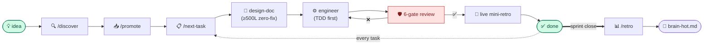

# AI-Workflows

A portable **AI control-plane template** for Claude Code projects. One
install gets your project a layered system of `CLAUDE.md` files,
specialized subagents, user-invocable skills, mechanical rule maps,
design-doc templates, a sprint/backlog workflow, and a 6-gate review
loop — distilled from production codebases that share these conventions.

No re-building from scratch. Architecture-agnostic by default; opinionated
extras opt-in via presets.

## Quick start

```bash
# 1. Clone the template
git clone https://github.com/Maximumsoft-Co-LTD/claude-flightdeck.git ~/code/claude-flightdeck

# 2. Install into your project (core is architecture-agnostic)
~/code/claude-flightdeck/install.sh ~/code/my-project

# 3. Health check (exits non-zero on any FAIL)
bash ~/code/my-project/.claude/skills/onboard/scripts/doctor.sh

# 4. Open in Claude Code; run /onboard (~4-6h interactive setup wizard)
#    Then start working:
#      /next-task   /post-delegation-gate   /retro   /ratify-rules
```

**Prereqs:** `bash` + `git` · `jq` (`brew install jq` / `apt install jq`) ·
optional `gh` for CI gate / `/flightdeck-feedback`. **Claude Code plugins**
(install via `/plugin` → `claude-plugins-official`): **`pr-review-toolkit`**
(required) + **`superpowers`** (strongly recommended). `/onboard` Stage 0
checks both. **Windows:** `install.ps1` or WSL —
[`docs/windows-install.md`](docs/windows-install.md).

**Try without committing:** `--dry-run` previews every file the installer
would write.

> Sample project at [`examples/url-shortener-go-hex/`](examples/url-shortener-go-hex/)
> — 3 sprints of real artifacts (STATUS, designs, retros, FOLLOWUPS).
> ~20 min walkthrough starting at its `docs/spec/STATUS.md`.

## The workflow

Each feature flows **idea → ship → retro** through 6 stages; each stage
produces an artifact, and the next can't start until the previous lands.



**The non-negotiables:**
- **Design-first (A005)** — no code without a merged design doc
- **TDD-first (A001)** — failing test before implementation
- **6-gate review (A004)** — inspect → build+test → boundary → spec-compliance →
  quality → wiring → smoke. No skips, ever.
- **Live mini-retro (A009)** — every task captures learning before the next
- **Carry-overs to FOLLOWUPS** — never evaporate

Full picture: [`docs/control-plane-architecture.md`](docs/control-plane-architecture.md)
(7 layers, every diagram).

## What you get

```
target-project/
├── CLAUDE.md                # root orchestrator manual
├── .claude/
│   ├── agents/              # backend-engineer, frontend-engineer,
│   │                        #   orchestrator, design-doc-writer,
│   │                        #   senior-tech-lead, sprint-retro-author
│   ├── skills/              # /onboard /next-task /assign /post-delegation-gate
│   │                        #   /retro /ratify-rules /dispatch-parallel
│   │                        #   /design-review /deploy /recover /document …
│   ├── rules/               # brain-hot · agent-pre-task-ritual · phase-matrix
│   │                        #   programming-fundamentals · git-workflow · lsp-first
│   ├── hooks/               # PostToolUse lint (gofmt / ruff / eslint / prettier / …)
│   └── settings.json        # permission allowlist + hook wiring
├── docs/
│   ├── playbooks/           # post-delegation-review (6-gate) · contract-first
│   ├── designs/_templates/  # zero-fix DESIGN_TEMPLATE + size tiers
│   ├── setup/               # workflow-master, lesson-trigger-map, …
│   └── spec/                # STATUS · backlog · FOLLOWUPS · sprints/ · retros/
└── .ai-workflows/
    └── manifest.json        # version + install metadata (drives upgrade)
```

**Architecture-agnostic by default.** `backend-engineer` and `frontend-engineer`
read your project's learned conventions (`.claude/rules/code-style.md`,
generated by `/onboard`) and conform to your real style. Opinionated
architectures (hex, FSD, …) come from presets:

| Preset | Adds |
|---|---|
| `k8s-helm` | `k8s-engineer` + `docs/setup/production-infrastructure.md` |
| _custom_ | Author your own — see [`docs/adding-new-preset.md`](docs/adding-new-preset.md) |

## Install reference

```bash
./install.sh <target>                                # interactive prompts
./install.sh <target> --profile restricted           # permission profile
./install.sh <target> --preset k8s-helm              # opt-in preset
./install.sh <target> --brain-path ~/Obsidian/brain  # external Brain
./install.sh <target> --config template.config       # non-interactive
./install.sh <target> --dry-run                      # preview only
./install.sh <target> --force                        # overwrite existing .claude/
```

**Permission profiles** (`--profile`): `restricted` (read-only Bash) ·
`standard` (default — go/make/git/gh/docker/npm/curl/jq) · `permissive`
(`Bash(*)` with destructive deny-list). Details:
[`core/docs/setup/permission-profiles.md`](core/docs/setup/permission-profiles.md).

### After install: run `/onboard`

Installing puts the templates in place. To make Claude Code **understand
your project** — fill `CLAUDE.md`, mine git history for project-local
A-rules, draft per-area `CLAUDE.md`, seed STATUS/backlog/FOLLOWUPS —
open the project in Claude Code and run `/onboard`. The 8-stage hybrid
wizard takes **~4-6 hours** and leaves you with a control plane filled
from your project's real evidence, not placeholders. Multi-repo aware:
inherits ratified rules from sibling installs.

Operator companion: [`core/docs/setup/onboarding-guide.md`](core/docs/setup/onboarding-guide.md).

## Versioning & upgrades

Version lives in [`VERSION`](VERSION) (semver). Every install writes
`<target>/.ai-workflows/manifest.json` recording version, install date,
template source commit, profile, presets, and placeholder names.

```bash
./install.sh --version                 # template version
./install.sh diff <target>             # mtime-based drift (path-only)
./install.sh upgrade <target>          # classified scan (dry-run)
./install.sh upgrade <target> --apply-safe   # apply safe overwrites
```

`upgrade` is the supported path (replaces the old `--force` re-install
flow). It reads the manifest, walks the new template, and categorizes
every file into **5 sections** via
[`core/.flightdeck-upgrade.json`](core/.flightdeck-upgrade.json):

| Section | What it is | `--apply-safe` action |
|---|---|---|
| **SAFE OVERWRITE** | Template-owned files that changed (agents, skills, playbooks, design templates) | Overwrite (backup first) |
| **NEW** | Template-owned files added since install | Create (backup if exists) |
| **NEEDS MERGE** | Seed-then-extends files (`CLAUDE.md`, `brain-hot.md`, `settings.json`) — would lose your customizations | **Skipped** — hand-merge |
| **NEW seed** | Seed files the install never had | **Skipped** — hand-merge |
| **SKIPPED** | User-owned (sprints, retros, designs, FOLLOWUPS, STATUS, agent memory) | **Never touched** |

The scan also prints **migration notes** extracted from `CHANGELOG.md`
between your installed version and the target. Backups land at
`<target>/.ai-workflows/upgrade-backups/v<from>-to-v<to>-<ts>/` for
one-command rollback.

**PowerShell:** `install.ps1 upgrade` is not yet supported — use the
bash installer under WSL.

## Editing the template itself

Each installed project's `.claude/` is **rendered output**. To lift a
rule back into the template, edit `core/` here (not the installed
project), then re-run `install.sh upgrade` into projects that should
get the update.

`CLAUDE.md` in this repo (not in `core/`) is the meta-manual for editing
the template.

## Feedback

Three feedback paths to
[`Maximumsoft-Co-LTD/claude-flightdeck`](https://github.com/Maximumsoft-Co-LTD/claude-flightdeck):

1. **GitHub issue forms** — 5 structured templates (bug / rule / preset /
   skill / onboarding) with version dropdown.
   [Open one](https://github.com/Maximumsoft-Co-LTD/claude-flightdeck/issues/new/choose).
2. **`/flightdeck-feedback`** inside Claude Code — drafts a structured
   issue from your session + manifest, redacts secrets, previews, opens
   via `gh`. Opt-in, one-shot.
3. **[Discussions](https://github.com/Maximumsoft-Co-LTD/claude-flightdeck/discussions)**
   for redacted retro excerpts — pure signal, zero LLM cost.

**Pull, not push.** Nothing phones home. No telemetry. Every send
previews first.

Full contribution guide: [`CONTRIBUTING.md`](CONTRIBUTING.md). Installed
projects also get [`docs/setup/feedback.md`](core/docs/setup/feedback.md)
with prefilled issue links.

## Source

- `idip-platform` — Go/Gin + Vue 3 + K8s + Obsidian Brain; richer hot rules
- `aggegator` — Go hex + Next.js FSD + Kafka + ClickHouse; richer playbooks

Universal *process* content shipped to `core/`. Tech-stack opinions live
in `presets/`.
