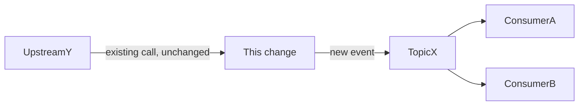
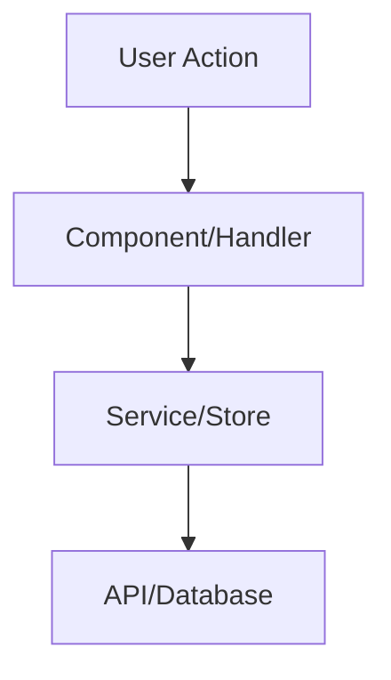

# Design: DXXX — [Task Name]

> **Sprint:** Sprint XX — [Theme]
> **Task Group:** X.X [Task Group Name]
> **Repo:** frontend | backend | multi
> **Status:** Draft | Approved | In Progress | Done
> **Type:** feat | fix | refactor | chore | docs | spike | release
> **Size:** XS | S | M | L  (pick via [`SIZE_TIERS.md`](./SIZE_TIERS.md))
> **Author:** [Tech Lead / design-doc-writer agent]
> **Date:** YYYY-MM-DD
> **Last Updated:** YYYY-MM-DD
> **Discovery Ref:** D### (or -- if no discovery item)

---

## Drafting workflow

> **Before drafting:** read [`SIZE_TIERS.md`](./SIZE_TIERS.md) to set
> `Size` correctly — the tier determines which sections below are
> required vs. optional vs. delete.
>
> **Before submitting:** run [`SELF_REVIEW_CHECKLIST.md`](./SELF_REVIEW_CHECKLIST.md)
> — the 5 scans + extra checks for M/L. Failing self-review = burn
> a cycle at the gate.

---

## 1. Overview

### User Story
> As a [role], I want [action] so that [benefit].

### Scope
**In scope:**
- [what this design covers]

**Out of scope:**
- [what this design does NOT cover — defer to future tasks]

### Dependencies
| Dependency | Status | Notes |
|-----------|--------|-------|
| [e.g., Backend Auth API] | Done / In Progress / Not Started | [link or description] |

---

## 1.5 Cross-System Impact & Knowledge Gaps

> **Why this section exists:** the most expensive bugs are the ones
> that are locally-correct but globally-wrong. This section forces the
> design author to (a) name every downstream system / business process
> this change touches, and (b) declare honestly where they lacked the
> knowledge to make a safe call. The orchestrator surfaces both to the
> user **before gate approval** so risks become decisions, not
> discoveries.

### 1.5.1 Blast Radius (what this change AFFECTS)

> Enumerate every system / service / consumer / business process that
> could feel this change. Be liberal — false positives here are cheap;
> a missed downstream is what causes Saturday-night incidents.

| # | Downstream consumer | How affected | Risk grade | Mitigation |
|---|---------------------|--------------|------------|------------|
| 1 | [e.g. mobile app v3.x clients] | API field becomes nullable | HIGH | Ship server-side default for 1 release before flipping; coordinate with mobile team via `#mobile-api` |
| 2 | [e.g. nightly reporting ETL] | New event topic; existing topic unchanged | LOW | None — additive only |
| 3 | [e.g. RBAC module] | Adds a new permission key | MEDIUM | Migration must seed default-deny; document in retro for L050 |

**Risk grade legend:**
- **HIGH** — breaking change, cross-team coordination needed, or downstream that pages on failure. Orchestrator surfaces to user before approval.
- **MEDIUM** — recoverable degradation, needs heads-up to owners but no coordination.
- **LOW** — additive / behind a flag / no observable change to consumers.

**Cross-system dependency sketch** (optional but recommended for ≥1 HIGH or ≥2 MEDIUM rows):



### 1.5.2 Knowledge Gaps (what the design author DOESN'T KNOW)

> Distinct from `## 10. Open Questions` (which has a default to ratify).
> A knowledge gap is **"I don't have enough information to even propose a
> defensible default"** — typically because the relevant context lives
> outside this repo (other team's service, undocumented business rule,
> production data shape, vendor API quirk). Declare them honestly — a
> hidden gap becomes a load-bearing bug.

| # | What I need to know | Why I need it | Likely source | Impact if I guess wrong | Resolved? |
|---|---------------------|---------------|---------------|-------------------------|-----------|
| 1 | [e.g. Exact retry semantics of the upstream `pricing-svc` /quote endpoint] | Determines whether our handler is idempotent or needs dedup | Pricing team / `pricing-svc` runbook | Could double-charge on retry storms | [ ] |
| 2 | [e.g. Whether finance ETL reads from the `orders` view or the raw table] | Decides if a column rename is safe or breaks the morning report | Data team / `#data-platform` | Silent reporting drift Mon AM | [ ] |

**If any row is unresolved at design completion** → the design-doc-writer
returns `NEEDS_CONTEXT` (NOT `DONE_WITH_CONCERNS`), because by
definition there's no default to ratify. The orchestrator routes the
question to the user (and where possible, to a human with the context)
before re-dispatching.

---

## 2. Architecture & Approach

### High-Level Flow


### Data Flow & Side-Effects (L023 — MANDATORY for write operations)
> Specify every side-effect that happens per step. If any step is missing, the feature is incomplete.

```
[Action: e.g., Save Page]
  1. Validate & sanitize input
  2. Write to main table (entity_main)
  3. → [Side-effect] Create version snapshot (entity_versions)
  4. → [Side-effect] Extract links → upsert (entity_links)   ← must be explicit
  5. → [Side-effect] Update search index for FTS
  6. Return response
```

### Key Decisions
| Decision | Rationale | Alternatives Considered |
|---------|-----------|------------------------|
| [e.g., Use a centralized store for auth state] | [why] | [what else was considered] |

### File Structure (files to create/modify)
```
repo/
  src/
    new-file-1.ts       <- CREATE: [purpose]
    existing-file.ts    <- MODIFY: [what changes]
    new-file-2.ts       <- CREATE: [purpose]
```

### 2.5 Routing & Navigation (MANDATORY for pages with UI)
> Delete this section if this is a backend-only task with no frontend page.

#### Routes
| Path | Route Name | Layout | Auth | Roles | Page Component |
|------|-----------|--------|------|-------|---------------|
| /path/:param | route-name | main / auth / portal | yes / no | [roles or 'all'] | ComponentName |

#### Menu Integration (if page reached from a sidebar)
| Menu Label (i18n) | Path | Roles | File to Modify |
|-------------------|------|-------|---------------|
| `nav.xxx` | /path | [roles] | `src/config/menu.ts` |

> If NOT a menu item (e.g. sub-page, modal), state how the user navigates to it.

#### Navigation Flow
```
User enters from: [sidebar menu / dashboard card / notification / cross-page link]
  → [Page Name]
    → exits to: [list of pages user can navigate to from here]
```

#### Route Params → API Params Mapping
| Route Param | API Param | Source | Notes |
|-------------|-----------|--------|-------|
| :projectId | :projectId | project list / URL | UUID |
| :spaceSlug | :spaceId | resolved via store lookup | slug → id conversion needed |

#### Layout (L029)
- Layout: (main / auth / portal / none) — set via route.meta.layout, NOT imported in page
- Menu active state: which sidebar item should be highlighted on this page

#### Navigation Flow
- User journey from sidebar click to page load
- Browser back/forward expected behavior

> **Route Registry:** update `docs/contracts/route-registry.md` every time a new route is added.

### 2.6 Frontend Component Spec (MANDATORY for UI tasks)
> Delete this section if this is a backend-only task.
> **Every page / component must spell out all sub-sections** — agent must NOT make these decisions on its own.

#### Layout Assignment (L029)
- Layout: `main` / `auth` / `portal` / `none` — set via `route.meta.layout` only
- **Do NOT import a Layout component in a page** — the root layout handles it.

#### State Management
| State | Type | Source | Fetch Trigger | Cache |
|-------|------|--------|---------------|-------|
| [e.g., ticket list] | Centralized store / local ref / composable | API `GET /api/v1/...` | onMounted / route watcher / manual | none / TTL / invalidate on mutation |

**Decision rules:**
- Shared across pages → centralized store
- Page-local only → local ref / state
- Reusable logic → composable / hook

#### UX States (every page must spell out all 4)
| State | Pattern | Component/Approach |
|-------|---------|-------------------|
| **Loading** | skeleton / spinner / inline text | [e.g., skeleton grid 3 cards] |
| **Empty** | icon + message + CTA button | [e.g., "No tickets yet" + Create button] |
| **Error** | toast / inline message / full page | [e.g., inline error severity + retry button] |
| **Success** (write ops) | toast / redirect / inline | [e.g., redirect to detail page] |

#### Error Handling
| Error Type | HTTP Code | Frontend Action |
|-----------|-----------|----------------|
| Validation | 400 | Show inline field errors |
| Unauthorized | 401 | Redirect to login |
| Forbidden | 403 | Show "Access denied" message |
| Not found | 404 | Show "Not found" with back button |
| Server error | 500 | Show error toast + retry button |
| Network error | — | Show offline banner + auto-retry |

#### Form Spec (if there is a form)
> Delete this section if the page has no form.

| Aspect | Decision |
|--------|----------|
| Validation timing | realtime (onBlur) / on submit / both |
| Frontend validation | [which fields, what rules] |
| Backend validation | [which fields server validates] |
| Submit behavior | disable button + spinner / optimistic update |
| Unsaved changes | warn on navigate away / auto-save / none |
| Double-submit prevention | disable button / debounce / Idempotency-Key |

#### Responsive Breakpoints
| Breakpoint | Layout Changes |
|-----------|---------------|
| Desktop (1280+) | [default layout] |
| Tablet (768-1279) | [changes: e.g., sidebar collapses, grid 2→1 col] |
| Mobile (<768) | [changes: e.g., card layout, bottom sheet, hide secondary info] |

### 2.7 Interactive Behavior Map (P012 — MANDATORY for UI tasks)
> Every interactive element (button, link, icon, menu item) must spell out its behavior.
> **Do NOT create elements that do nothing on click — Action column empty = design fail.**

| Component | Element | Trigger | Action | Target/Result | Feedback |
|-----------|---------|---------|--------|---------------|----------|
| [PageName] | "[Button text]" btn | click | navigate / API call / dialog | [path or result] | [loading/toast/confirm/highlight] |
| [PageName] | Row click | click | navigate | [detail page path] | row hover highlight |
| [PageName] | "Submit" btn | click | POST API → redirect | [target page] | btn disabled+spinner → success toast |
| [PageName] | "Cancel" btn | click | confirm if dirty → router.back() | previous page | confirm dialog if unsaved changes |
| [PageName] | "Delete" btn | click | confirm dialog → DELETE API | redirect to list | confirm dialog → loading → success toast |
| [PageName] | "Back" link | click | router.back() | previous page | — |

**Rules:**
- Every button that calls an API: `disabled` while loading + spinner icon + error toast on failure
- Every navigation link / button: spell out the target path (not just "goes somewhere")
- Destructive actions (delete, archive, discard): require a confirmation dialog
- "Cancel" / "Back": spell out router.back() vs. specific route + dirty-state check
- Login / OAuth redirect: use `router.replace()` not `router.push()` (prevents back to login)
- **Error Toast Rule (L041):** every `catch` block must show an error toast / message OR re-throw to the caller — no empty `catch {}`

### 2.8 User Journey (P012 — MANDATORY for pages with UI)
> Spell out the step-by-step user flow from entry to exit — every step must have a back path.

#### Happy Path (Primary Flow)
```
1. User clicks [entry point] in sidebar/card/link → [PageName] loads
2. Loading skeleton shows (0.3-1s)
3. Data loaded → content renders
4. User clicks [primary action] → [what happens]
5. [Result] → [feedback: toast/redirect/inline update]
6. Back button: goes to [step N], state [preserved/reset]
```

#### Error Flows
```
API 400 (validation) → inline field errors (red border + message)
API 403 (forbidden) → "Access denied" message + link to dashboard
API 404 (not found) → "Not found" message + back button
API 500 (server error) → error toast + retry button
Network error → offline banner + auto-retry after 5s
```

#### Browser Navigation Behavior
| Action | Expected Behavior | State |
|--------|-------------------|-------|
| Back | returns to [previous page] | form state LOST / list position preserved |
| Forward | returns to current page | normal |
| Refresh (F5) | page reloads from API | URL params preserved, form state lost |
| Direct URL paste | works with auth guard | redirect to login if not authenticated |
| After login | `router.replace('/dashboard')` | prevent back to login form |

### 2.9 Web Interface Guidelines Checklist (P013 — MANDATORY for UI tasks)

> **Reference:** `docs/contracts/web-interface-guidelines.md`
> **Automated Review:** run the `/web-design-guidelines <file>` skill after implementation
> Check every relevant item before marking done — mark non-relevant items N/A.

#### Accessibility
- [ ] Icon-only buttons have `aria-label`
- [ ] Form controls have `<label>` or `aria-label`
- [ ] `<button>` for actions, `<a>` for navigation (no `<div onClick>`)
- [ ] Decorative icons have `aria-hidden="true"`
- [ ] Async updates (toasts, validation errors) use `aria-live="polite"` or `role="alert"`
- [ ] Focus first error field on form submit validation fail

#### Focus & Interaction
- [ ] All interactive elements have `:focus-visible` styles
- [ ] No `outline: none` without replacement focus indicator
- [ ] `touch-action: manipulation` on interactive containers
- [ ] Destructive actions have confirmation dialog

#### Forms
- [ ] Inputs have `autocomplete` and correct `type`
- [ ] `spellcheck="false"` on email/code/username inputs
- [ ] Placeholders end with `…` and show example pattern
- [ ] Submit button: enabled until request starts, spinner during request
- [ ] Errors inline next to fields + focus first error on submit

#### Animation & Performance
- [ ] `@media (prefers-reduced-motion: reduce)` disables/reduces animations
- [ ] Only animate `transform`/`opacity` (compositor-friendly)
- [ ] No `transition: all` — list properties explicitly
- [ ] No layout reads in render (`offsetHeight`, `getBoundingClientRect`)

#### Theming & Dark Mode
- [ ] All colors use CSS variables (no hardcoded hex in component styles)
- [ ] Success/error/warning states use semantic CSS variables

#### Typography & Content
- [ ] Loading states use `…` (ellipsis character, not `...`)
- [ ] Text containers handle long content (truncate/line-clamp/break-words)
- [ ] Empty states handled — no broken UI for empty arrays/strings

### 2.10 i18n Translation Keys (L063 — MANDATORY for UI tasks)
> Delete this section if this is a backend-only task.
> **Every key the component will use as `t('...')` must be listed here — agent must add to every language file.**
> **Do NOT let the agent invent keys — PM specifies every key path in design.**

#### Key Namespace
```
{module}.{page/context}.{element}
```

#### Translation Keys
| Key | EN | TH / second-language |
|-----|----|----|
| `module.page.title` | Page Title | … |
| `module.page.col_name` | Name | … |
| `module.page.create` | Create Item | … |
| `module.status.active` | Active | … |
| `module.status.draft` | Draft | … |

> **Verification:** after implementation, grep every `t('...')` in created/changed components → every key must exist in every language file.
> **Anti-pattern:** Agent claims "i18n added" but the key isn't actually in the JSON — open the file and verify.

---

## 3. API Contract

### Endpoints
```
METHOD /api/v1/path
  Auth: required | optional | none
  Roles: [which roles can access]

  Request:
    Headers: { Authorization: Bearer <token> }
    Body: {
      field_name: type   ← treat this name as source of truth
    }

  Response (200):
    {
      "data": { ... },
      "meta": { "request_id": "uuid" }
    }

  Errors:
    400: { "error": { "code": "VALIDATION_ERROR", "message": "..." } }
    401: { "error": { "code": "UNAUTHORIZED", "message": "..." } }
    403: { "error": { "code": "FORBIDDEN", "message": "..." } }
    404: { "error": { "code": "NOT_FOUND", "message": "..." } }
```

> **Field Name Lock (L020/L008):** Body field names defined here are the ONLY names agents may use.
> Backend implements these names. Frontend sends these names. E2E tests use these names.
> Do NOT use a different field name without updating this design doc first.

### Data Types (shared between frontend & backend)

> **JSDoc Convention (L042):** Percentage / rate fields MUST include a JSDoc comment specifying range and display instruction.
> Example: `/** Percentage 0-100, display directly. Do NOT multiply by 100. */`

```typescript
interface ResourceName {
  id: string
  // ... fields
  /** Percentage 0-100, display directly. Do NOT multiply by 100. */
  // example_rate: number
  created_at: string  // ISO 8601
  updated_at: string  // ISO 8601
}
```

---

## 4. Data Model

### New Tables / Types
```sql
-- Migration: YYYYMMDDHHMMSS_create_table_name.up.sql
CREATE TABLE IF NOT EXISTS table_name (
  id UUID PRIMARY KEY DEFAULT gen_random_uuid(),
  -- fields
  created_at TIMESTAMPTZ NOT NULL DEFAULT NOW(),
  updated_at TIMESTAMPTZ NOT NULL DEFAULT NOW()
);

CREATE INDEX IF NOT EXISTS idx_table_field ON table_name(field);
```

### Relationships
```
table_a.field_id -> table_b.id (FK, ON DELETE CASCADE)
```

### Migration Verification Checklist (L026 — MANDATORY if this design has migrations)
> Root PM must run this themselves — agents do not have live DB access.

- [ ] `migrate up` succeeds (not dirty)
- [ ] New tables / columns verified in live DB
- [ ] Trigger / function names match existing convention
- [ ] An endpoint that uses the new table — does not 500

---

## 5. Design Aesthetic (P011)

> **Only for frontend pages that trigger P011** — delete this section if not applicable (backend-only, small UI tweak)

| Item | Decision |
|------|----------|
| Aesthetic Direction | [e.g., Playful/dynamic, Industrial/utilitarian, Editorial/magazine] |
| Typography | Headings: [font], Body: [font] |
| Color Accent | [dominant + accent color, CSS var names] |
| Motion Strategy | [key animations: page load, hover, transitions] |
| Spatial Composition | [layout approach: density, whitespace, asymmetry] |

---

## 6. Test Plan

### Unit Tests
| Test | File | What it verifies |
|------|------|-----------------|
| [test name] | `src/__tests__/file.test.ts` | [behavior] |
| [test name] | `src/__tests__/file.test.ts` | [edge case] |

### Integration Tests
> Include cross-role tests for every feature with RBAC or content visibility (L022)
> **RBAC Negative Test MANDATORY:** every handler test file must have at least one test where an unauthorized role gets 403.

| Test | Role | Expected HTTP | What it verifies |
|------|------|--------------|-----------------|
| GET resource — authorized | admin | 200 | Returns correct shape |
| GET resource — unauthorized | developer | **403** | **RBAC negative test (MANDATORY)** |
| GET draft — reader | reader | 403 | Draft visibility guard |
| POST without permission | developer | 403 | Write permission enforced |

### E2E Tests
> E2E spec file: `e2e/[module]/[feature].spec.ts`
> **MUST RUN before marking task Done** — do NOT defer (L021)

| Scenario | Steps | Expected Result |
|---------|-------|----------------|
| Happy path | 1. Do X -> 2. Do Y | See Z |
| RBAC negative | 1. Login as restricted role -> 2. Try action | Access denied |

### E2E Selector Map (L020 — MANDATORY for UI tasks)
> Every interactive element E2E will interact with must have a stable selector (e.g. `data-testid`) locked here.
> Frontend uses this name. E2E uses this name. They must not differ.

| Component | Element | Selector value | Used in E2E spec |
|-----------|---------|--------------------|--------------------|
| [ComponentName] | [button/input/section description] | `noun-action` | `e2e/[file].spec.ts` |

**Convention:** `noun-first-kebab-case` — `new-page-btn`, `approve-btn`, `page-content`, `version-history-panel`

### Test Data Requirements
```
Seed data needed:
- [entity] with [specific attributes]
- [entity] linked to [relationship]
```

---

## 7. Implementation Tasks

> Ordered by dependency. Tests come FIRST (TDD).

| # | Task | Design Ref | Size | Status |
|---|------|-----------|------|--------|
| 1 | Write unit tests for [service/store] | S6 | S | [ ] |
| 2 | Write cross-role integration tests | S6, S8 | S | [ ] |
| 3 | Implement [types/models] | S3, S4 | S | [ ] |
| 4 | Implement [service/store] with side-effects | S2 | M | [ ] |
| 5 | Implement [component/handler] with selectors | S6 | M | [ ] |
| 6 | Implement [UI/route] | S2 | M | [ ] |
| 7 | Wire up and verify all unit + integration tests pass | S6 | S | [ ] |
| 8 | **Run E2E — must pass before marking Done** | S6 | M | [ ] |

**Legend:** S = Small (< 1hr), M = Medium (1-3hr), L = Large (3hr+)

---

## 8. RBAC & Security

### 8A. Role Name Mapping (L025 — MANDATORY for any RBAC feature)
> E2E fixtures use aliases, backend DB uses full name, frontend type must match backend.
> **Runtime-verify (e.g. `curl /api/v1/auth/me`) before writing frontend types.**

| E2E alias | Backend DB role | Frontend `UserRole` type |
|-----------|-------------------------------|-------------------------|
| pm        | `product_manager`             | `'product_manager'`     |
| dev       | `developer`                   | `'developer'`           |
| reader    | `internal_staff`              | `'internal_staff'`      |
| admin     | `support_admin`               | `'support_admin'`       |

> **Rule:** Frontend role checks (canAccess, menu filter, route guard) must use values from the "Frontend UserRole type" column only.
> Do NOT use E2E aliases as role values in production code.

### 8B. Action Permission Matrix (who can DO what)
> "Frontend conditionally renders" + "Backend enforces" — both required.

| Action | Admin | PM | Developer | Tester | Sales | Internal Staff |
|--------|-------|----|-----------|--------|-------|---------------|
| [action] | allow | allow | deny | deny | deny | deny |

### 8C. Content Visibility Matrix (L022 — MANDATORY for content with lifecycle/status)
> For resources with status (draft / review / published), spell out what HTTP code the API returns.
> **Both frontend conditional render AND backend API enforcement must match.**

| Role | draft | review | published | Backend returns (403 or 200) |
|------|-------|--------|-----------|------------------------------|
| Admin/PM | show | show | show | 200 always |
| Developer (write) | show | show | show | 200 if write perm |
| Reader/Staff | **hide** | **hide** | show | **403** for draft/review |

> Backend MUST return 403 (not 200) when a reader requests draft/review content — UI hiding alone is insufficient.

### 8D. Security Considerations
- [ ] Input validation on [fields]
- [ ] XSS prevention on [user content]
- [ ] CSRF protection via [mechanism]
- [ ] Rate limiting on [endpoints]
- [ ] Content visibility enforced at API layer, not just UI layer (L022)

---

## 9. Acceptance Criteria

> Copied from sprint file + expanded with technical verification.
> Each AC must reference a specific test (unit/integration/E2E).

| # | Criteria | Backend Test | Frontend Test | E2E | Status |
|---|---------|-------------|--------------|-----|--------|
| AC1 | [criteria] | `TestXxx` | `describe Xxx` | `scenario` | [ ] |
| AC2 | Reader cannot see draft | `TestDraftVisibility_ReaderGets403` | hide element | rbac.spec.ts | [ ] |
| AC3 | [side-effect: e.g., backlink populated] | `TestExtractLinks` | n/a | bidirectional-links.spec.ts | [ ] |

---

## 10. Open Questions / Risks

> Every question the design author was unsure about. The orchestrator
> surfaces these to the user **before gate approval** so decisions land
> in the doc, not as last-minute discoveries during implementation.
>
> Severity legend (set by `design-doc-writer`):
> - **load-bearing** — wrong guess means rework in days (architecture,
>   data model, scope, contract, RBAC). If you see one here the doc
>   should have been returned `NEEDS_CONTEXT`; treat as STOP.
> - **material** — wrong guess means a recoverable edit cycle (API
>   shape, error semantics, migration strategy). Decide before impl.
> - **cosmetic** — wrong guess means a one-line patch (naming, ordering,
>   wording). Skim and override only if needed.
>
> Each question carries the author's **default + reason + impact-if-wrong**
> so the user can OK/override in one read.

| # | Question | Severity | Default picked | Why this default | Impact if wrong | Resolved? |
|---|----------|----------|----------------|------------------|-----------------|-----------|
| 1 | [e.g. Should `priority` be nullable on the API response?] | material | non-null, default="normal" | matches existing `Task.priority` in `models/task.go:42` | Frontend `?? "normal"` fallback breaks for legacy rows | [ ] |

**After the user decides:** flip `Resolved?` to `[x]`, update `Default
picked` to the chosen answer, and add a Change Log row recording who
decided and when.

---

## Change Log

| Date | Change | Reason |
|------|--------|--------|
| YYYY-MM-DD | Initial design | Task created |
