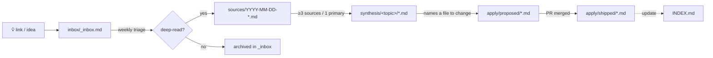

# Research Workspace

> A living research library whose single job is to make **our Claude Code
> SDLC template better, continuously**. Findings flow in as raw links and
> flow out as concrete changes to `core/`, `presets/`, agents, skills, and
> rules.

This folder is **not shipped** by the installer (it copies only `core/` +
`presets/`). It lives in the template repo for maintainers.

## The framework: Capture → Process → Synthesize → Apply

```
inbox/      🟢  Capture     dump links/ideas, zero friction
sources/    🟡  Process     1 file per source, distilled notes
synthesis/  🔵  Synthesize  cross-source patterns by topic
apply/      🟣  Apply       proposed & shipped template changes
```

Each stage raises the bar. A link only earns a `source` note if it's worth
reading closely; a topic only earns a `synthesis` note once ≥3 sources (or
1 primary source) agree; a synthesis only becomes an `apply` once it names
a concrete file to change. This filtering is the point — it keeps noise out
of the template.

## The loop



## How to use it (the 10-second version)

**Got a link?** Add one line to [`inbox/_inbox.md`](inbox/_inbox.md):

```
- [2026-05-30] https://example.com/post — why it caught my eye  #claude-code-core
```

That's it. Don't read it now. Triage later.

**Ready to go deeper?** See each stage's own README:

- [`inbox/README.md`](inbox/README.md) — capture rules
- [`sources/README.md`](sources/README.md) — how to write a source note
- [`synthesis/README.md`](synthesis/README.md) — when & how to synthesize
- [`apply/README.md`](apply/README.md) — turning insight into template changes

## Taxonomy (the 6 research tracks)

| Track | What it covers |
|---|---|
| `claude-code-core` | Claude Code itself — skills, sub-agents, hooks, MCP, plugins, slash commands, CLAUDE.md craft |
| `adjacent-tools` | Cursor, Aider, Cline, Codex CLI, Continue — patterns worth borrowing |
| `sdlc-with-ai` | spec-driven dev, TDD-with-AI, AI review, planning, evals |
| `legacy-modernization` | understanding & refactoring legacy code with agents |
| `complex-systems` | large codebases, monorepos, distributed systems, context at scale |
| `software-tech` | architecture & engineering patterns that make code agent-friendly |

## Cadence

| When | Do | Time |
|---|---|---|
| Ad-hoc | Drop links into `inbox/` | seconds |
| Weekly | Triage inbox → write `sources/` notes | ~30 min |
| Bi-weekly | Synthesize topics with ≥3 sources | ~1 h |
| Monthly | Promote high-confidence synthesis → `apply/proposed/` → PR | ~1 h |

See [`METHODOLOGY.md`](METHODOLOGY.md) for source-quality scoring and the
gates between each stage. See [`INDEX.md`](INDEX.md) for the current state
of every track.
