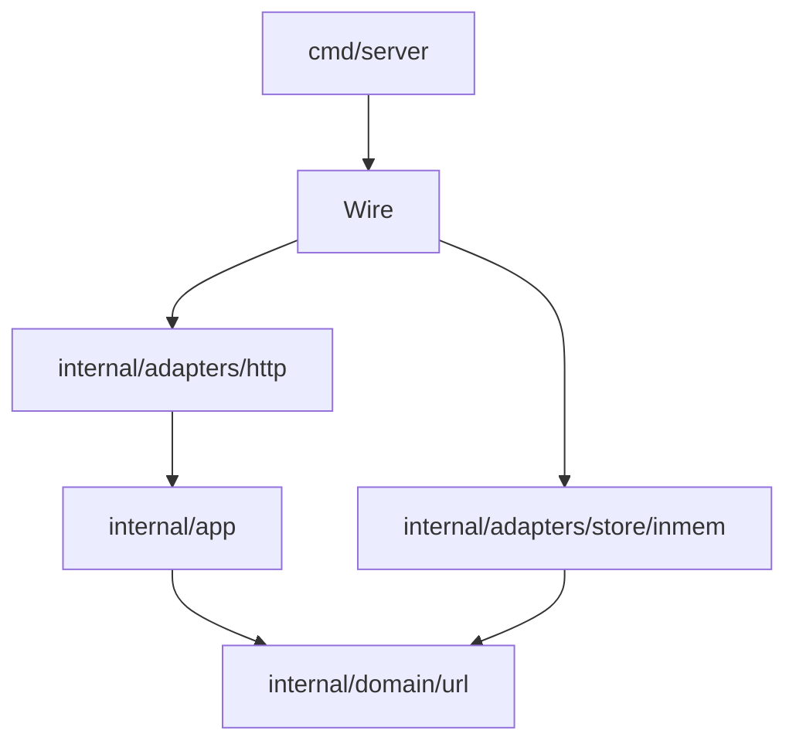

# Design: D001 — Hex skeleton + `cmd/server` wiring

> **Sprint:** S01 — Bootstrap
> **Task:** URLSH-S01.01
> **Repo:** backend (single-repo)
> **Status:** Done
> **Type:** feat
> **Size:** M  (per [`SIZE_TIERS.md`](../../_templates/SIZE_TIERS.md) — multi-file, real logic, no public contract yet)
> **Author:** design-doc-writer (refined by @alice)
> **Date:** 2026-04-06
> **Last Updated:** 2026-04-09 (closed Open Questions at gate)
> **Discovery Ref:** -- (greenfield)

---

## 1. Overview

### User Story
> As a service engineer, I want a hex-layout skeleton with a working `cmd/server` boot path so subsequent sprints have a clear seam for adapters and a clean domain core to build on.

### Scope

**In scope:**
- `cmd/server/main.go` — boot wiring (config → adapters → ports → handlers)
- `internal/app/` — application use cases (stubbed; first real one lands in URLSH-S01.04)
- `internal/adapters/http/` — chi-router + healthz handler (the route lives in URLSH-S01.02)
- `internal/adapters/store/inmem/` — placeholder `urlrepo.Store` (real implementation in URLSH-S01.03)
- `internal/domain/url/` — domain types (`ShortCode`, `LongURL`, brand types)
- `Wire()` helper (hand-written DI; we're not introducing wire/fx yet — L of complexity not worth the dep)

**Out of scope:**
- The actual `/healthz` handler — separate task URLSH-S01.02
- The actual store impl — separate task URLSH-S01.03
- Any HTTP route besides the placeholder — URLSH-S01.04 ships the first real endpoint
- Database / Redis / observability — all S02+

### Dependencies

| Dependency | Status | Notes |
|-----------|--------|-------|
| Go 1.22 toolchain | Done | `go.mod` pins `go 1.22.2` |
| chi router (`github.com/go-chi/chi/v5`) | Done | minimal HTTP mux; no middleware stack yet |
| structured logging (`log/slog`) | Done | stdlib; no zap/zerolog dep |

---

## 2. Architecture & Approach

### High-Level Flow



The arrow direction is the **dependency direction**: `cmd` knows
everyone, adapters know the app, the app knows the domain. Nothing
points up. `domain` is the inner ring with zero imports from inside
`internal/`. This is the boundary the `hexagonal-reviewer` agent will
police at every gate.

### Key Decisions

| Decision | Rationale | Alternatives considered |
|----------|-----------|-------------------------|
| Hand-written `Wire()` (no wire / fx / uber-zap stack) | M-tier project; one binary; explicit wiring is more readable than codegen for the next 6 months. Reconsider when we add `cmd/rollup-worker` (S03) | google/wire, uber/fx |
| `internal/` for everything below `cmd/` | Standard Go layout; nothing outside this repo will import these packages | flat `pkg/` layout, `internal/<service>/` if we ever multi-binary |
| `chi/v5` for routing | Lightweight, idiomatic, good middleware story; team's existing experience | gorilla/mux (in maintenance mode), stdlib `http.ServeMux` (1.22 patterns OK but middleware story weaker for our planned auth in S04) |

### File Structure

```
url-shortener/
  cmd/
    server/
      main.go            <- CREATE: entrypoint; reads env, calls Wire(), starts HTTP server
  internal/
    app/
      app.go             <- CREATE: App struct holding ports; placeholder use case
    adapters/
      http/
        router.go        <- CREATE: chi router + middleware skeleton
        healthz.go       <- CREATE (stub): placeholder; real handler in URLSH-S01.02
      store/
        inmem/
          store.go       <- CREATE (stub): satisfies `urlrepo.Store` port; real impl URLSH-S01.03
    domain/
      url/
        types.go         <- CREATE: ShortCode, LongURL brand types + validation
    ports/
      urlrepo/
        store.go         <- CREATE: Store interface (port)
  go.mod                 <- CREATE
  go.sum                 <- CREATE
  Makefile               <- CREATE: build / test / smoke / migrate / lint targets
```

### (Section skipped per M-tier — XS/S only) ~~2.5 Routing & Navigation~~

> Skipped — backend-only, no UI in this task.

### (Section skipped per M-tier — UI tasks only) ~~2.6 Frontend Component Spec~~

> Skipped — backend-only.

---

## 3. API Contract

Just the placeholder for `/healthz` — concrete shape ships with URLSH-S01.02.

```
GET /healthz
  Auth: none
  Roles: all
  Response (200):
    { "sha": "<build-sha>", "uptime_s": <int> }
```

> Note flagged at gate (resolved): D001 originally had a full `/shorten` contract — that was L-tier scope and got deleted. The S01 retro identified this as the design-doc-writer needing to consult `SIZE_TIERS.md` before drafting.

---

## 4. Data Model

> Skipped — no DB this sprint. First migration lands in URLSH-S02.01.

---

## 5. (Section skipped — M-tier non-UI) Design Aesthetic

> Skipped — backend-only.

---

## 6. Test Plan

### Unit tests

| Test | File | What it verifies |
|------|------|-----------------|
| `TestWire_BootsCleanly` | `cmd/server/main_test.go` | `Wire()` returns a non-nil App with all ports populated |
| `TestShortCode_Validate` | `internal/domain/url/types_test.go` | brand type rejects empty / non-alnum / too-long codes |
| `TestLongURL_Validate` | `internal/domain/url/types_test.go` | brand type accepts `http(s)://…`; rejects `javascript:` and `file:` |

### Integration tests

> Skipped this task — no real adapter to integrate yet. First integration test lands in URLSH-S01.04.

---

## 7. Implementation Tasks

> Ordered by dependency. Tests come FIRST (TDD).

| # | Task | Design ref | Size | Status |
|---|------|-----------|------|--------|
| 1 | Write `TestShortCode_Validate` + `TestLongURL_Validate` (red) | §6 | S | [x] |
| 2 | Implement `domain/url/types.go` (green) | §2 file structure | S | [x] |
| 3 | Define `ports/urlrepo/store.go` interface | §2 file structure | S | [x] |
| 4 | Write `TestWire_BootsCleanly` (red) | §6 | S | [x] |
| 5 | Implement `cmd/server/main.go` + `Wire()` (green) | §2 file structure | M | [x] |
| 6 | Implement `internal/app/app.go` (placeholder use case) | §2 file structure | S | [x] |
| 7 | Stub `internal/adapters/http/router.go` + healthz placeholder | §2 file structure | S | [x] |
| 8 | Stub `internal/adapters/store/inmem/store.go` | §2 file structure | S | [x] |
| 9 | Wire `Makefile` build/test/lint targets | §2 file structure | XS | [x] |

---

## 8. (Section skipped — no RBAC yet) RBAC & Security

> Skipped — auth lands in S04.

---

## 9. Acceptance Criteria

| # | Criteria | Test | Status |
|---|---------|------|--------|
| AC1 | `go build ./...` exits 0 | `make build` | [x] |
| AC2 | `Wire()` boots without panic and returns a valid App | `TestWire_BootsCleanly` | [x] |
| AC3 | `hexagonal-reviewer` agent reports 0 boundary violations | gate 3 of post-delegation review | [x] |
| AC4 | `domain/url` package has zero imports from `internal/adapters/*` or `cmd/*` | grep + manual | [x] |
| AC5 | `make lint` passes (`golangci-lint run`) | `make lint` | [x] |

---

## 10. Open Questions / Risks

| # | Question / Risk | Decision | Resolved? |
|---|-----------------|----------|-----------|
| 1 | Hand-rolled DI vs wire/fx — will it scale to 3+ binaries? | Defer until URLSH-S03.03 (`cmd/rollup-worker`); re-evaluate then | [x] (deferred-with-trigger) |
| 2 | Should `internal/app` and `internal/domain` be merged? | No — domain stays pure (no port deps); app holds the ports | [x] |
| 3 | Rollback if Wire() turns out to be a mess | Revert this commit; previous commit was empty repo | [x] |

---

## Change Log

| Date | Change | Reason |
|------|--------|--------|
| 2026-04-06 | Initial design | Task created |
| 2026-04-07 | Removed §3 `/shorten` contract section | M-tier scope per SIZE_TIERS.md — `/shorten` is URLSH-S01.04 |
| 2026-04-09 | Closed Open Questions 1, 2, 3 at gate | Gate review |
