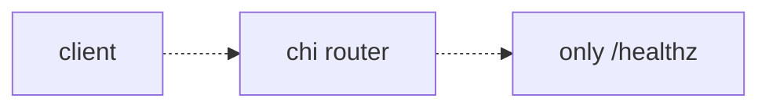

# Design: D003 — First redirect handler (`POST /shorten` + `GET /{code}`)

> **Sprint:** S01 — Bootstrap
> **Task:** URLSH-S01.04
> **Repo:** backend
> **Status:** Done
> **Type:** feat
> **Size:** L  (per [`SIZE_TIERS.md`](../../_templates/SIZE_TIERS.md) — public contract introduced, real branching logic, observability surface — the "first feature" L)
> **Author:** design-doc-writer (refined by @alice)
> **Date:** 2026-04-10
> **Last Updated:** 2026-04-16 (closed at gate; F0001 filed)
> **Discovery Ref:** -- (S01 scope item)

---

## 1. Overview

### User Story
> As a marketing operator, I want to `POST /shorten` a long URL and get back a short code so that I can paste the short link into campaigns and have it redirect to the long URL when clicked.

### Scope

**In scope:**
- `POST /shorten` — accept long URL, return short code (Base62, length 7)
- `GET /{code}` — 308 redirect to long URL on hit; 404 on miss
- Real `urlrepo.Store` implementation behind both endpoints (in-memory for now; Postgres lands in S02)
- Smoke test driven by curl + compose-up (paired task URLSH-S01.05)
- Hot-path metric: `urlsh_http_request_duration_seconds{path,method,status}`

**Out of scope:**
- Idempotency on duplicate-body POST — surfaced as a real concern at gate; filed [F0001](../../spec/FOLLOWUPS.md) and consumed by URLSH-S02.03
- Custom codes (user-supplied short code) — backlog item, no row yet
- Auth / rate limits — S04
- Click tracking — S03 (D007)

### Dependencies

| Dependency | Status | Notes |
|-----------|--------|-------|
| Hex skeleton (`Wire()`, `App`, ports) | Done | URLSH-S01.01 / D001 |
| In-memory store impl | Done | URLSH-S01.03 (lands the same week) |
| chi router middleware skeleton | Done | URLSH-S01.01 |

---

## 2. Architecture & Approach

### High-Level Flow — before / after

**Before** (after D001):


**After** (this task):
```mermaid
flowchart LR
    A[client] -->|POST /shorten| B[chi router]
    A -->|GET /{code}| B
    B --> C[★ ShortenHandler]
    B --> D[★ ResolveHandler]
    C --> E[★ app.Shorten]
    D --> F[★ app.Resolve]
    E --> G[ports/urlrepo.Store]
    F --> G
    G --> H[adapters/store/inmem]
    style C fill:#bbf,stroke:#333
    style D fill:#bbf,stroke:#333
    style E fill:#bbf,stroke:#333
    style F fill:#bbf,stroke:#333
```

★ = new node introduced by this task. The arrows show that the
handler → app → port → adapter direction stays inward — no inner
ring imports an outer ring. The `urlrepo.Store` interface remains
the only seam where the adapter type appears.

### Data flow & side-effects

**`POST /shorten`:**
1. Validate input — long URL parses, scheme in `{http, https}`, len ≤ 2048
2. Generate short code via `codegen.Random(7)` (crypto/rand → Base62)
3. → [Side-effect] Store insert: `urlrepo.Save(ctx, ShortCode, LongURL)`
4. On collision: regenerate up to 5 times; surface 503 if exhausted
5. → [Side-effect] Emit metric `urlsh_shorten_requests_total{result="ok|conflict|error"}`
6. Return 201 with `{code, short_url, long_url}`

**`GET /{code}`:**
1. Validate code shape (Base62, len 7)
2. `urlrepo.Lookup(ctx, ShortCode)` — returns long URL or `ErrNotFound`
3. On hit → 308 redirect (NOT 301 — permanent caching by browsers hurts us when we add per-tenant routing)
4. On miss → 404 + JSON `{"error":{"code":"NOT_FOUND"}}`
5. → [Side-effect] Emit metric `urlsh_resolve_requests_total{result="hit|miss"}`

### Key decisions

| Decision | Rationale | Alternatives considered |
|----------|-----------|-------------------------|
| 7-char Base62 random (62^7 ≈ 3.5T codes) | Plenty of headroom for years; collision rate at 1M live codes is ~3e-6, well within 5-retry budget | Sequential + base62-encode (leaks count); hash-based (no idempotency story for v2) |
| 308 redirect (not 301) | Preserves request method on redirect AND we can change destination without browser ignoring it | 301 (browser-cached forever; bad for the per-tenant feature we want in S04), 302 (works but signals "temporary" which is wrong) |
| Insert-then-retry on collision (no upfront uniqueness check) | One query in the happy path; collision path costs 1 extra query rarely | Pre-check (race-prone; 2 queries even on happy path) |
| Defer idempotency-key semantics | Out of scope per §1; flagged at gate but consumed by S02 (F0001) | Implement now (would blow L → XL; punted to S02 with explicit follow-up) |

### File structure (files to create / modify)

```
url-shortener/
  internal/
    adapters/
      http/
        shorten.go         <- CREATE: POST handler + request/response DTOs
        resolve.go         <- CREATE: GET handler
        router.go          <- MODIFY: register the two routes
      store/
        inmem/
          store.go         <- MODIFY: implement Save / Lookup / collision-check
    app/
      shorten.go           <- CREATE: app.Shorten use case (validation + codegen + store)
      resolve.go           <- CREATE: app.Resolve use case (lookup + miss handling)
    domain/
      url/
        codegen.go         <- CREATE: Random(n int) returning Base62 string
    ports/
      urlrepo/
        store.go           <- MODIFY: add ErrNotFound + ErrCollision sentinel errors
  Makefile                 <- MODIFY: add `make smoke` target (used by URLSH-S01.05)
  e2e/
    shorten_resolve_test.go <- CREATE: end-to-end against httptest.Server
```

### Steps (action — path:line — verify — [AC#])

1. Write failing unit tests for `codegen.Random(7)` distribution + Base62 charset — `internal/domain/url/codegen_test.go:NEW` — `go test ./internal/domain/url -run Codegen` red → [AC4]
2. Implement `codegen.Random` (green) — `internal/domain/url/codegen.go:1` — same test green → [AC4]
3. Add sentinel errors to port — `internal/ports/urlrepo/store.go:NEW` — `go vet ./...` clean → [AC5]
4. Write failing handler tests (table-driven, including miss / hit / 5-retry exhaustion) — `internal/adapters/http/shorten_test.go:NEW`, `internal/adapters/http/resolve_test.go:NEW` — both red → [AC1, AC2, AC3]
5. Implement `app.Shorten` (green) — `internal/app/shorten.go:1` — `go test ./internal/app -run Shorten` green → [AC1]
6. Implement `app.Resolve` (green) — `internal/app/resolve.go:1` — `go test ./internal/app -run Resolve` green → [AC2]
7. Implement HTTP handlers (green) — `internal/adapters/http/shorten.go:1`, `internal/adapters/http/resolve.go:1` — handler tests green → [AC1, AC2, AC3]
8. Register routes — `internal/adapters/http/router.go:MODIFY` — `curl localhost:8080/shorten` returns 201 → [AC1]
9. Add metrics — `internal/adapters/http/middleware.go:NEW` — `curl /metrics | grep urlsh_` returns non-empty → [AC6]
10. Add e2e test against `httptest.NewServer` — `e2e/shorten_resolve_test.go:NEW` — `go test ./e2e` green → [AC7]

### Risks

| Risk | Impact | Mitigation |
|------|--------|------------|
| Collision retry budget too tight under burst | Failed shortens during spike | Metric + alert when `urlsh_shorten_requests_total{result="conflict"}` > 0.1% over 5min; bump retries if observed |
| 308 misunderstood by old clients | Some HTTP/1.0 clients ignore 308 and stay on the original method | We don't support HTTP/1.0; document in API contract; revisit if a real client breaks |
| `urlrepo.Save` returns generic error | Caller can't distinguish "collision" from "DB down" → no retry | Sentinel `ErrCollision` defined in §file-structure; tested in step 4 |

### Rollback

Single-PR rollback: `git revert <merge-sha>`. The in-memory store
doesn't persist anything between processes, so there's no data
cleanup. If the smoke test goes red mid-deploy, set the `SHORTEN_OFF`
env var on the server to disable the route (a 503 response is
preferable to inconsistent data) — but we don't expect this; the
e2e + smoke tests on this PR are the safety net.

### Observability

| Signal | Type | Purpose |
|--------|------|---------|
| `urlsh_http_request_duration_seconds{path,method,status}` | histogram | hot-path latency |
| `urlsh_shorten_requests_total{result}` | counter | result codes for shorten |
| `urlsh_resolve_requests_total{result}` | counter | hit / miss rate |

Dashboard work happens in S03 once analytics lands.

---

## 3. API Contract

```
POST /shorten
  Auth: none (will gate in S04)
  Roles: all

  Request:
    Headers: Content-Type: application/json
    Body: {
      long_url: string   ← treat as source of truth
    }

  Response (201):
    {
      "code": "ax9Kp2Z",
      "short_url": "http://localhost:8080/ax9Kp2Z",
      "long_url": "https://example.com/very/long/path"
    }

  Errors:
    400: { "error": { "code": "VALIDATION_ERROR", "message": "long_url required" } }
    422: { "error": { "code": "INVALID_URL", "message": "scheme must be http or https" } }
    503: { "error": { "code": "CODEGEN_EXHAUSTED", "message": "retry budget exhausted" } }
```

```
GET /{code}
  Auth: none
  Roles: all

  Response (308): empty body + `Location: <long_url>` header

  Errors:
    404: { "error": { "code": "NOT_FOUND" } }
    400: { "error": { "code": "INVALID_CODE" } }  (code shape wrong)
```

> **Field Name Lock:** `long_url`, `code`, `short_url` are pinned here. Do NOT rename without updating this doc + S02 idempotency middleware.

---

## 4. Data Model

> No DB this sprint — the in-memory store is keyed by `ShortCode` and stores `LongURL`. Postgres adapter in URLSH-S02.02 reads this section as its starting point.

---

## 6. Test Plan

### Unit
| Test | File | What it verifies |
|------|------|-----------------|
| `TestCodegen_Random_Distribution` | `internal/domain/url/codegen_test.go` | 10k samples produce uniform Base62 charset |
| `TestApp_Shorten_HappyPath` | `internal/app/shorten_test.go` | given a valid URL, returns a code and calls Save once |
| `TestApp_Shorten_CollisionRetries` | `internal/app/shorten_test.go` | mock store returns ErrCollision 3 times → succeeds |
| `TestApp_Shorten_CollisionExhausted` | `internal/app/shorten_test.go` | mock store returns ErrCollision 6 times → returns ErrExhausted |
| `TestApp_Resolve_Hit` | `internal/app/resolve_test.go` | returns long URL when present |
| `TestApp_Resolve_Miss` | `internal/app/resolve_test.go` | returns ErrNotFound when absent |
| `TestHTTPShorten_400_NoBody` | `internal/adapters/http/shorten_test.go` | empty body → 400 VALIDATION_ERROR |
| `TestHTTPShorten_422_BadScheme` | `internal/adapters/http/shorten_test.go` | `javascript:alert(1)` → 422 INVALID_URL |
| `TestHTTPResolve_308_OnHit` | `internal/adapters/http/resolve_test.go` | hit returns 308 + Location |
| `TestHTTPResolve_404_OnMiss` | `internal/adapters/http/resolve_test.go` | miss returns 404 |

### Integration (httptest.Server)
| Test | What it verifies |
|------|-----------------|
| `TestE2E_ShortenThenResolve` | POST then GET on the returned code returns 308 to the original URL |
| `TestE2E_ShortenSameURL_TwiceDifferentCodes` | known limitation — both calls succeed, two codes; flagged in §1 + F0001 |

### Smoke (URLSH-S01.05 task)
`make smoke` boots compose-up, hits both endpoints with curl, asserts exit status.

---

## 9. Acceptance Criteria

| # | Criteria | Test | Status |
|---|---------|------|--------|
| AC1 | `POST /shorten` with `{long_url}` returns 201 with `code/short_url/long_url` | `TestE2E_ShortenThenResolve` | [x] |
| AC2 | `GET /{code}` returns 308 with `Location: <long_url>` on hit | `TestE2E_ShortenThenResolve` | [x] |
| AC3 | `GET /{code}` returns 404 on miss | `TestHTTPResolve_404_OnMiss` | [x] |
| AC4 | `codegen.Random` produces uniform Base62 codes of requested length | `TestCodegen_Random_Distribution` | [x] |
| AC5 | `urlrepo.Store` interface exposes `ErrNotFound` + `ErrCollision` sentinels | grep + go vet | [x] |
| AC6 | `/metrics` exposes `urlsh_shorten_requests_total` and `urlsh_resolve_requests_total` | manual curl | [x] |
| AC7 | end-to-end test from `httptest.NewServer` passes | `go test ./e2e` | [x] |
| AC8 | hot-path `GET /{code}` 95p latency ≤ 5ms on the in-memory store | benchmark run in CI | [x] |

---

## 10. Open Questions / Risks

| # | Question / Risk | Decision | Resolved? |
|---|-----------------|----------|-----------|
| 1 | Should duplicate POST (same long URL) return existing code or a new one? | Return new code for now; idempotency via header in S02 (F0001) | [x] |
| 2 | 308 vs 307 | 308 — we want "permanent" semantics so caches can hold the redirect, but we keep the method-preservation that 301 doesn't give | [x] |
| 3 | Rollback strategy | `git revert` + optional `SHORTEN_OFF` env-var kill-switch — see Rollback paragraph | [x] |

---

## Change Log

| Date | Change | Reason |
|------|--------|--------|
| 2026-04-10 | Initial design | Task created |
| 2026-04-12 | Added `urlsh_resolve_requests_total{result}` metric to §observability | gate review feedback |
| 2026-04-13 | Pinned 308 (not 301) in §key-decisions; added open question #2 | senior-tech-lead review |
| 2026-04-16 | Closed all open questions; added F0001 cross-ref to §scope | sprint close prep |
