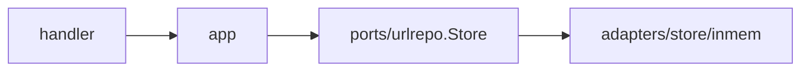
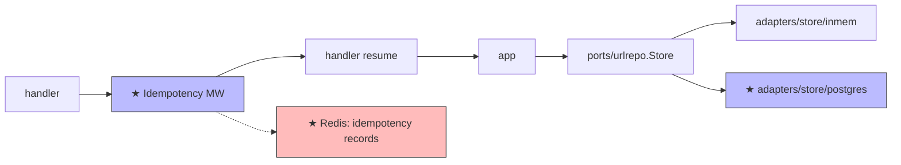

# Design: D004 — Postgres persistence + `Idempotency-Key` middleware

> **Sprint:** S02 — Persistence
> **Tasks:** URLSH-S02.01, URLSH-S02.02, URLSH-S02.03 (single L doc spanning three tasks because they share the schema, the port impl, and the conflict-replay contract)
> **Repo:** backend
> **Status:** Done
> **Type:** feat
> **Size:** L  (per [`SIZE_TIERS.md`](../../_templates/SIZE_TIERS.md) — DB migration on a populated table not applicable yet but the design is L because it pins the public contract for the Idempotency-Key header, introduces sqlx as a runtime dep, and spans three coordinated tasks)
> **Author:** design-doc-writer (refined by @alice)
> **Date:** 2026-04-20
> **Last Updated:** 2026-05-01 (closed at gate; consumed F0001; opened F0002, F0005)
> **Discovery Ref:** -- (S02 scope item)

---

## 1. Overview

### User Story
> As the service team, I want durable URL storage so that shortened links survive process restarts; AND as an API consumer, I want `POST /shorten` to be safely retryable via `Idempotency-Key` so that network blips don't create duplicate codes.

### Scope

**In scope:**
- Postgres schema for `urls` (id, code, long_url, tenant_id, created_at, updated_at, deleted_at)
- `golang-migrate` runner wired into `make migrate up | down | status`
- sqlx-based `urlrepo.Store` adapter implementing all port methods
- `Idempotency-Key` middleware on `POST /shorten`:
  - Same key + same body → replay prior 201 response (same `code`)
  - Same key + **different** body → 422 `IDEMPOTENCY_KEY_REUSED`
  - No key → behaves as before (S01 contract preserved)
- Idempotency record TTL: 24h (configurable via `IDEMPOTENCY_TTL`)
- Migration verification checklist (L026) per L-tier convention

**Out of scope:**
- Redis cache wiring (URLSH-S02.04 — separate task, separate design doc, except for §4 cache section below which it inherits)
- Hot-path Redis retrieval (URLSH-S02.05 — partial; lifted to S03 / D008)
- Tenant onboarding / row-level security — S04+

### Dependencies

| Dependency | Status | Notes |
|-----------|--------|-------|
| Postgres 15 | Done | docker-compose service `postgres:15-alpine` |
| `github.com/jmoiron/sqlx` | New | go.mod entry added in this PR |
| `github.com/golang-migrate/migrate/v4` | New | go.mod entry; `make migrate` wraps it |
| `github.com/redis/go-redis/v9` | New | for idempotency record storage (NOT the URL cache — that's URLSH-S02.04) |
| Hex skeleton (`ports/urlrepo`) | Done | D001 |

---

## 2. Architecture & Approach

### High-Level Flow — before / after

**Before** (after S01):


**After** (this task):


★ = new node introduced by this task. The in-memory store stays
present (for tests + local dev without Postgres); production wiring
selects the Postgres adapter via env var.

### Data flow & side-effects

**`POST /shorten` with `Idempotency-Key: <uuid>`:**
1. Middleware: `Idempotency.Lookup(ctx, key)`
2. If hit → compare request body hash; on match, return cached response (skip handler entirely)
3. If hit + hash mismatch → 422 `IDEMPOTENCY_KEY_REUSED`
4. If miss → continue to handler; record (key, body-hash, status, response) on the way out
5. → [Side-effect] `Idempotency.Save(ctx, key, body-hash, status, response, ttl=24h)`
6. Handler runs as in D003 §2 — call `app.Shorten` → write to `urls`

**Postgres adapter `Save`:**
1. Transaction begins
2. Insert into `urls` with the generated short code
3. Unique constraint on `code` enforced by DB; conflict → return `ErrCollision` (caller retries codegen, per D003 §2)
4. → [Side-effect] Emit metric `urlsh_db_query_duration_seconds{op="save",result="ok|conflict|error"}`
5. Commit; on error, rollback

### Key decisions

| Decision | Rationale | Alternatives considered |
|----------|-----------|-------------------------|
| sqlx over plain `database/sql` | Less boilerplate for the common Get / Select; still gives us full control over queries; the team has prior experience | pgx (more powerful but adds another driver dep), GORM (rejected — too much magic for a Store at this layer) |
| `golang-migrate` CLI, not embedded migrations | Operations team is already running `migrate` against other services | Embedded (atlas, goose); rejected because we want migrations to be runnable independent of the binary for ops emergencies |
| Hash body for idempotency match (SHA-256, hex-encoded) | Cheap, collision-free for our body sizes (≤ 8 KB); avoids storing the body itself | Store raw body (memory cost), structural compare (JSON-key order brittle) |
| Redis for idempotency records (not Postgres) | 24h TTL + high read throughput; we already added go-redis as a dep | Postgres with `expires_at` + cron cleanup (chosen path for S03 if Redis proves expensive) |
| Idempotency record TTL = 24h | Long enough to cover client retry-with-backoff sessions; short enough to bound the Redis footprint | 1h (too aggressive), 7d (no observed need; consumer SDK retries within 30s) |
| 422 (not 409) on key-reuse-different-body | 422 = "request well-formed, semantically wrong"; 409 implies "state conflict, retry might help" which is misleading | 409 (rejected — see rationale) |

### File structure

```
url-shortener/
  migrations/
    20260420120000_create_urls.up.sql      <- CREATE
    20260420120000_create_urls.down.sql    <- CREATE
    20260420120030_create_idempotency.up.sql   <- CREATE (Redis schema — for docs only; no DDL)
  internal/
    adapters/
      store/
        postgres/
          store.go               <- CREATE: Save / Lookup / Delete / Regenerate
          store_test.go          <- CREATE: testcontainers-driven integration tests
          types.go               <- CREATE: sqlx row structs + scanners
      middleware/
        idempotency.go           <- CREATE: middleware, key validation, replay logic
        idempotency_test.go      <- CREATE: table tests covering all 4 paths
      idempotencyrepo/
        redis.go                 <- CREATE: Save / Lookup against Redis
    ports/
      idempotencyrepo/
        store.go                 <- CREATE: port interface (Lookup, Save)
      urlrepo/
        store.go                 <- MODIFY: add Delete, Regenerate methods
    config/
      config.go                  <- MODIFY: add DBUrl, RedisAddr, IdempotencyTTL
  Makefile                       <- MODIFY: migrate / migrate-down / migrate-status targets
  docker-compose.yml             <- MODIFY: add postgres + redis services
```

### Files touched (counts)

| Path | Action | Lines (approx) |
|------|--------|----------------|
| `migrations/*` | CREATE | 80 |
| `internal/adapters/store/postgres/` | CREATE | ~380 |
| `internal/adapters/middleware/idempotency*` | CREATE | ~260 |
| `internal/adapters/idempotencyrepo/redis.go` | CREATE | ~120 |
| `internal/ports/idempotencyrepo/store.go` | CREATE | 22 |
| `internal/ports/urlrepo/store.go` | MODIFY | +18 |
| `internal/config/config.go` | MODIFY | +24 |
| `Makefile` | MODIFY | +15 |
| `docker-compose.yml` | MODIFY | +30 |

### Steps (action — path:line — verify — [AC#])

#### Phase 1 — schema + migration runner (URLSH-S02.01)
1. Write up + down SQL — `migrations/20260420120000_create_urls.*.sql:NEW` — `make migrate up` clean from empty DB → [AC1]
2. Write down/up round-trip test in CI — `.github/workflows/db.yml:NEW` — round-trip leaves DB empty → [AC2]
3. Wire `make migrate up|down|status` — `Makefile:MODIFY` — `make migrate status` shows version → [AC1]

#### Phase 2 — Postgres adapter (URLSH-S02.02)
4. Write failing integration tests (testcontainers) — `internal/adapters/store/postgres/store_test.go:NEW` — `go test -tags=integration ./internal/adapters/store/postgres` red → [AC3, AC4]
5. Implement `Save` with `ErrCollision` on unique-constraint violation — `internal/adapters/store/postgres/store.go:1` — `Save` test green → [AC3]
6. Implement `Lookup`, `Delete`, `Regenerate` — same file — all four method tests green → [AC3, AC5]
7. Add `urlsh_db_query_duration_seconds` histogram — `internal/adapters/store/postgres/store.go:METRICS` — `curl /metrics | grep db_query` non-empty → [AC9]
8. Wire `Wire()` to select postgres adapter via env — `cmd/server/main.go:MODIFY` — boot picks postgres when `DB_URL` set → [AC6]

#### Phase 3 — Idempotency middleware (URLSH-S02.03)
9. Write failing middleware tests (4 paths: miss-then-save, hit-replay, key-reuse-diff-body-422, no-key-passthrough) — `internal/adapters/middleware/idempotency_test.go:NEW` — all red → [AC7]
10. Implement Redis adapter for idempotency records — `internal/adapters/idempotencyrepo/redis.go:1` — `Save` / `Lookup` round-trip test green → [AC7]
11. Implement middleware — `internal/adapters/middleware/idempotency.go:1` — all middleware tests green → [AC7, AC8]
12. Register middleware on `POST /shorten` route — `internal/adapters/http/router.go:MODIFY` — e2e replay test green → [AC8]
13. Add `urlsh_idempotency_requests_total{result="hit|miss|conflict|nokey"}` — middleware file — `/metrics` non-empty → [AC9]

### Alternatives considered

Captured in the Key Decisions table — full rationale at column 3 of each row. No alternative made it to a separate ADR; that bar would mean "we'd revisit this in the next 12 months" and none of these are likely.

### Risks

| Risk | Impact | Mitigation |
|------|--------|------------|
| Idempotency record loses + retry → duplicate `code` | Two short codes for same long URL on retry-window edge | TTL = 24h; consumer SDK retry budget is 30s; mismatch is non-fatal for users (just two codes). Documented in §1 out-of-scope. |
| Postgres unique-constraint violation looks like a generic error | Caller can't distinguish ErrCollision from network blip → no retry | Postgres adapter inspects pq error code `23505` and returns the sentinel; covered by test |
| `Idempotency-Key` accepts any string (including 10MB) | DoS via huge keys | **Open at gate close — see F0002.** Recommendation: 128-char limit, ASCII-printable only. To be implemented in a follow-up sprint. |
| `Idempotency-Key` conflict messaging confuses clients | Support load | 422 body includes both the cached response status and a clear `message` field; documented in §3 |
| Redis unavailable when middleware needs it | `POST /shorten` 5xx during outage | Middleware fails open: log + emit `urlsh_idempotency_requests_total{result="degraded"}` + skip idempotency check; original handler still runs. Captured as a known degradation in Rollback |

### Rollback

Phased rollback because this is L-tier:

1. **Code rollback:** `git revert <merge-sha>` reverts middleware + adapter. The Postgres data remains; the new code is gone and the in-memory store takes over (server restart picks up the wire change from env).
2. **Schema rollback:** `make migrate down` runs `20260420120000_create_urls.down.sql`. Safe because the table is new — no live consumers depend on it yet. (S03+ would change this; the rollback runbook will need an update at S03 close.)
3. **Redis cleanup:** idempotency records auto-expire in 24h; no manual cleanup needed.
4. **Verification post-rollback:** `make smoke` from S01 still passes (in-memory store path), proving the rollback is clean.

### Observability

| Signal | Type | Purpose | Alert |
|--------|------|---------|-------|
| `urlsh_db_query_duration_seconds{op,result}` | histogram | DB-side latency + error rate | p95 > 50ms for 10m → page |
| `urlsh_idempotency_requests_total{result}` | counter | replay-vs-miss-vs-conflict ratio | `result="conflict"` rate > 1% → page (likely SDK bug) |
| `urlsh_idempotency_requests_total{result="degraded"}` | counter | Redis-down detection | any non-zero rate for 5m → page |
| `urlsh_db_connections_in_use` | gauge | connection-pool pressure | sustained > 80% of max → warn |

---

## 3. API Contract

```
POST /shorten
  Auth: none (S04)
  Roles: all

  Request:
    Headers:
      Content-Type: application/json
      Idempotency-Key: <client-generated uuid v4 recommended>  ← OPTIONAL
    Body: {
      long_url: string
    }

  Response (201) — first call OR replay:
    {
      "code": "ax9Kp2Z",
      "short_url": "http://localhost:8080/ax9Kp2Z",
      "long_url": "https://example.com/very/long/path"
    }

  Errors:
    400: { "error": { "code": "VALIDATION_ERROR" } }
    422: { "error": { "code": "INVALID_URL" } }
    422: { "error": { "code": "IDEMPOTENCY_KEY_REUSED", "message": "key matched a prior request with a different body" } }
    503: { "error": { "code": "CODEGEN_EXHAUSTED" } }
```

> **Field Name Lock:** `long_url`, `code`, `short_url` unchanged from D003. `Idempotency-Key` is the header — case-insensitive per RFC, but our middleware canonicalises to title-case.

---

## 4. Data Model

### New tables

```sql
-- migrations/20260420120000_create_urls.up.sql
CREATE TABLE IF NOT EXISTS urls (
  id          UUID PRIMARY KEY DEFAULT gen_random_uuid(),
  code        TEXT NOT NULL,
  long_url    TEXT NOT NULL,
  tenant_id   TEXT NOT NULL DEFAULT 'default',
  created_at  TIMESTAMPTZ NOT NULL DEFAULT NOW(),
  updated_at  TIMESTAMPTZ NOT NULL DEFAULT NOW(),
  deleted_at  TIMESTAMPTZ NULL
);

CREATE UNIQUE INDEX IF NOT EXISTS ux_urls_code_active ON urls(code) WHERE deleted_at IS NULL;
CREATE INDEX IF NOT EXISTS ix_urls_tenant_created ON urls(tenant_id, created_at);
```

### Migration verification checklist (L026)

> Root PM must run this themselves — agents do not have live DB access.

- [x] `make migrate up` succeeds (not dirty)
- [x] `urls` table created; `\d urls` matches schema
- [x] Down migration is the exact inverse (verified by round-trip test)
- [x] `POST /shorten` against a real Postgres returns 201
- [x] `GET /{code}` after restart still resolves (durability check)

---

## 6. Test Plan

### Unit
| Test | File | What it verifies |
|------|------|-----------------|
| `TestPostgresStore_Save_HappyPath` | `internal/adapters/store/postgres/store_test.go` | insert + read-back via Lookup |
| `TestPostgresStore_Save_Collision` | same | unique-constraint violation surfaces `ErrCollision` |
| `TestPostgresStore_Delete_SetsDeletedAt` | same | soft-delete sets `deleted_at` and Lookup returns ErrNotFound |
| `TestIdempotencyMW_NoKey_Passthrough` | `internal/adapters/middleware/idempotency_test.go` | no header → handler runs unchanged |
| `TestIdempotencyMW_Miss_RecordsResponse` | same | unknown key → handler runs, response saved |
| `TestIdempotencyMW_Hit_Replays` | same | known key + matching hash → returns cached response, handler NOT called |
| `TestIdempotencyMW_KeyReuse_DifferentBody_422` | same | known key + mismatching hash → 422 IDEMPOTENCY_KEY_REUSED |
| `TestIdempotencyMW_RedisDown_FailsOpen` | same | Redis returns error → metric "degraded", handler runs |

### Integration (testcontainers)
| Test | Role | Expected HTTP | What it verifies |
|------|------|--------------|------------------|
| `POST /shorten` (no key) | all | 201 | persists to Postgres |
| `POST /shorten` (key, retry same body) | all | 201 (replay) | second call hits middleware cache |
| `POST /shorten` (key, retry different body) | all | 422 | conflict surfaced |
| Restart server, `GET /{code}` | all | 308 | durability through restart |

---

## 9. Acceptance Criteria

| # | Criteria | Test | Status |
|---|---------|------|--------|
| AC1 | `make migrate up` runs clean from empty Postgres 15 | manual + CI | [x] |
| AC2 | Migration round-trip (up → down → up) leaves DB structurally identical | CI job | [x] |
| AC3 | `urlrepo.Store` Postgres adapter passes the same contract tests as the in-memory adapter | shared test suite | [x] |
| AC4 | `ErrCollision` surfaced on `code` unique-constraint violation | `TestPostgresStore_Save_Collision` | [x] |
| AC5 | `Delete` is soft (sets `deleted_at`); Lookup returns ErrNotFound for deleted rows | `TestPostgresStore_Delete_SetsDeletedAt` | [x] |
| AC6 | `Wire()` selects postgres adapter when `DB_URL` is set; falls back to in-memory otherwise | unit test on Wire() | [x] |
| AC7 | All 4 idempotency middleware paths covered by table tests | `TestIdempotencyMW_*` | [x] |
| AC8 | e2e replay scenario passes (same key + same body returns same `code`) | integration test | [x] |
| AC9 | `/metrics` exposes `urlsh_db_query_duration_seconds`, `urlsh_idempotency_requests_total`, `urlsh_db_connections_in_use` | manual + alert dashboard | [x] |
| AC10 | Rollback runbook (§Rollback) executes cleanly on a sample DB | dry-run by @alice | [x] |

---

## 10. Open Questions / Risks

| # | Question / Risk | Decision | Resolved? |
|---|-----------------|----------|-----------|
| 1 | Should Idempotency-Key reject keys > 128 chars / non-ASCII? | YES, but deferred to F0002 (high priority) — fuzz tests crashed sqlx parameter binding | [x] (deferred-with-followup) |
| 2 | Should we add `tenant_id` indexing right now or wait? | Now — cheap; the index lands with the migration; we'll need it in S04 | [x] |
| 3 | What if Redis is unavailable during a retry burst? | Fail open — metric `degraded` + handler runs (de-dup loses for that window) | [x] |
| 4 | Should the in-memory store be deleted now that Postgres exists? | No — useful for tests; tracked as B016 (debt, P3) | [x] |

---

## Change Log

| Date | Change | Reason |
|------|--------|--------|
| 2026-04-20 | Initial design | Task created |
| 2026-04-22 | Pinned 422 (not 409) for IDEMPOTENCY_KEY_REUSED | senior-tech-lead review |
| 2026-04-25 | Added §Observability `urlsh_idempotency_requests_total{result="degraded"}` | required by L201 lesson (S01 retro) |
| 2026-04-29 | Added Risk row "Idempotency-Key accepts huge strings" + filed F0002 | fuzz test discovery |
| 2026-05-01 | Closed all open questions; updated §6 to require clock-mock for the TTL test (per L201) | gate review + S02 retro action item |
