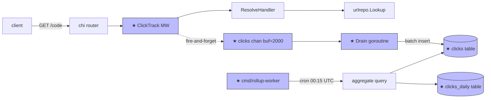

# Design: D007 — Click tracking + `clicks` table

> **Sprint:** S03 — Analytics
> **Tasks:** URLSH-S03.01 (middleware + table); URLSH-S03.03 (rollup worker — rolled into §4 of this doc)
> **Repo:** backend
> **Status:** Done (URLSH-S03.01) / Scheduled (URLSH-S03.03)
> **Type:** feat
> **Size:** M  (per [`SIZE_TIERS.md`](../../_templates/SIZE_TIERS.md) — additive schema + middleware + worker; no breaking contract)
> **Author:** design-doc-writer (refined by @alice)
> **Date:** 2026-05-04
> **Last Updated:** 2026-05-13 (closed F0007; added `tenant_id` to schema)

---

## 1. Overview

### User Story
> As a marketing operator, I want every redirect counted so I can see which campaigns drive traffic; without making the hot-path slower than baseline +1ms.

### Scope

**In scope:**
- `clicks` table — append-only event log of every `GET /{code}` hit
- Click-tracking middleware on the redirect route — non-blocking; emits to a buffered channel + drain goroutine
- `clicks_daily` rollup table (aggregated by code × day × tenant)
- `cmd/rollup-worker` cron worker — runs at 00:15 UTC; aggregates last 24h
- Hot-path latency budget: ≤ +1ms p99 vs S02 baseline

**Out of scope:**
- Admin reporting endpoint (URLSH-S03.04 — separate design TBD)
- Real-time analytics (stream → dashboard); current design is end-of-day batch
- PII handling beyond IP/UA hashing (S04 will revisit when we add tenant auth)

### Dependencies

| Dependency | Status | Notes |
|-----------|--------|-------|
| Postgres adapter | Done | D004 |
| Redis (already up for idempotency) | Done | reused for click-buffer overflow signal |
| `cron` for worker | New | `github.com/robfig/cron/v3` |

---

## 2. Architecture & Approach

### High-Level Flow



### Data flow & side-effects

**Hot path (`GET /{code}`):**
1. `ClickTrack` middleware runs FIRST — before `ResolveHandler`
2. Captures `{code, tenant_id, ts, referrer_hash, ua_hash, ip_hash}` into a `ClickEvent` value
3. Non-blocking send to `clicks` channel; on overflow → drop + increment `urlsh_clicks_dropped_total`
4. → [Side-effect] handler resumes; `ResolveHandler` does its work (this is the existing redirect from D003)

**Drain goroutine:**
1. Reads channel; accumulates batch (size=200) OR flushes on 500ms tick
2. → [Side-effect] `INSERT INTO clicks` (multi-row insert)
3. → [Side-effect] Metric `urlsh_clicks_inserted_total{result="ok|error"}`

**Rollup worker (`cmd/rollup-worker`, cron 00:15 UTC):**
1. Lock `clicks_daily` row for yesterday's date (PG advisory lock)
2. Run aggregation query: `SELECT code, tenant_id, DATE(ts) as day, COUNT(*) FROM clicks WHERE ts BETWEEN yesterday-start AND yesterday-end GROUP BY code, tenant_id, day`
3. Upsert into `clicks_daily` (idempotent — safe to re-run)
4. → [Side-effect] Metric `urlsh_rollup_runs_total{result}`; gauge `urlsh_rollup_last_success_ts_seconds`

### Key decisions

| Decision | Rationale | Alternatives |
|----------|-----------|--------------|
| Async fire-and-forget tracking | Hot-path latency budget +1ms requires this; synchronous Postgres write would blow 5-10ms easy | Synchronous (rejected, blows budget), Kafka (overkill, no message-bus in repo yet) |
| Channel + drain goroutine (no Kafka) | Kafka isn't in our stack; channel + batch insert is the simplest thing that hits the latency budget | Kafka, NATS, direct insert |
| Hash IP/UA/referrer (SHA-256, first 16 bytes) | Per-row de-identification; we don't need raw values for the aggregation | Store raw (GDPR pain), no hashing (rejected) |
| Daily batch rollup (not streaming) | The current product question is "how did this campaign do yesterday"; not real-time | Streaming aggregate (could land in S04 if needed) |
| Drop on channel overflow (vs blocking) | Tracking failure must NOT slow the redirect; metric the drops | Block (rejected — blows latency budget) |
| Cron worker as separate binary (`cmd/rollup-worker`) | Process isolation: rollup can crash without affecting the request server; ops can scale them independently | Goroutine inside `cmd/server` (rejected — coupling) |

### File structure

```
url-shortener/
  migrations/
    20260504100000_create_clicks.up.sql        <- CREATE
    20260504100000_create_clicks.down.sql      <- CREATE
    20260504100030_create_clicks_daily.up.sql  <- CREATE
    20260504100030_create_clicks_daily.down.sql<- CREATE
  cmd/
    rollup-worker/
      main.go               <- CREATE: cron entrypoint
  internal/
    adapters/
      middleware/
        clicktrack.go       <- CREATE: middleware + channel + drain
        clicktrack_test.go  <- CREATE: table tests + latency benchmark
      store/
        postgres/
          clicks.go         <- CREATE: BatchInsert
          rollup.go         <- CREATE: aggregate + upsert
    domain/
      analytics/
        click.go            <- CREATE: ClickEvent value type
    ports/
      clicksrepo/
        store.go            <- CREATE: BatchInsert, AggregateDay
  Makefile                  <- MODIFY: `make rollup-once` for local testing
```

### Steps

#### URLSH-S03.01 — middleware + clicks table
1. Write failing benchmark — `internal/adapters/middleware/clicktrack_bench_test.go:NEW` — asserts +1ms p99 budget; runs red before middleware → [AC2]
2. Create `clicks` migration — `migrations/20260504100000_create_clicks.*.sql:NEW` — `make migrate up` clean → [AC1]
3. Implement `ClickEvent` domain type — `internal/domain/analytics/click.go:1` → [AC3]
4. Implement middleware + drain — `internal/adapters/middleware/clicktrack.go:1` — benchmark green → [AC2, AC4]
5. Implement `BatchInsert` Postgres method — `internal/adapters/store/postgres/clicks.go:1` — unit test green → [AC5]
6. Wire middleware into `Wire()` — `cmd/server/main.go:MODIFY` — e2e: shorten → resolve → row in clicks → [AC6]
7. Add metrics — `clicktrack.go:METRICS` — `/metrics | grep clicks` non-empty → [AC7]

#### URLSH-S03.03 — rollup worker (scheduled, this section is the design for it)
8. Create `clicks_daily` migration — `migrations/20260504100030_create_clicks_daily.*.sql:NEW` → [AC1]
9. Implement aggregator — `internal/adapters/store/postgres/rollup.go:1` → [AC8]
10. Implement worker — `cmd/rollup-worker/main.go:1` — `make rollup-once` produces yesterday's rows → [AC9]

### Alternatives considered

See Key Decisions; no separate ADR — each row's column 3 is the alternative log.

### Risks

| Risk | Impact | Mitigation |
|------|--------|------------|
| Channel overflow drops clicks during traffic spike | Under-count in dashboards | Channel size = 2000 (5s of 400 RPS); metric the drops; alert on sustained drops |
| `BatchInsert` slow → drain lags → overflow | Cascade failure | Latency budget on insert: < 50ms p95 (alert); fall back to row-by-row insert if batch path errors |
| Rollup misses a day (worker crashed at 00:15) | Missing daily row | Worker is idempotent (UPSERT); ops cronjob `make rollup-backfill --date=...` to manually catch up; metric `urlsh_rollup_last_success_ts_seconds` alerts on stale |
| `tenant_id` column added late (D007 v1 missed it) — see F0007 | Schema drift; doc-vs-impl drift | Closed: added in v2 of this doc + the migration before merge; F0007 closed |

### Rollback

- Code: `git revert <merge-sha>`; middleware is removed, redirect goes back to pre-S03 path
- Schema: `make migrate down 2` reverses both migrations (clicks_daily then clicks)
- Worker: `kubectl delete deployment rollup-worker` (or `docker compose down rollup-worker` locally)
- Data: the `clicks` rows are append-only; no consumer broken by dropping the table; rollup_daily likewise

### Observability

| Signal | Type | Purpose |
|--------|------|---------|
| `urlsh_clicks_inserted_total{result}` | counter | drain pipeline health |
| `urlsh_clicks_dropped_total` | counter | channel overflow |
| `urlsh_clicks_drain_batch_size` | histogram | batch sizing efficiency |
| `urlsh_rollup_runs_total{result}` | counter | rollup success rate |
| `urlsh_rollup_last_success_ts_seconds` | gauge | rollup freshness; alert if > 26h |

---

## 4. Data Model

### Migrations

```sql
-- 20260504100000_create_clicks.up.sql
CREATE TABLE IF NOT EXISTS clicks (
  id             BIGSERIAL PRIMARY KEY,
  code           TEXT NOT NULL,
  tenant_id      TEXT NOT NULL,
  ts             TIMESTAMPTZ NOT NULL DEFAULT NOW(),
  referrer_hash  BYTEA NULL,
  ua_hash        BYTEA NULL,
  ip_hash        BYTEA NULL
);
CREATE INDEX IF NOT EXISTS ix_clicks_code_ts ON clicks(code, ts);
CREATE INDEX IF NOT EXISTS ix_clicks_tenant_ts ON clicks(tenant_id, ts);
```

```sql
-- 20260504100030_create_clicks_daily.up.sql
CREATE TABLE IF NOT EXISTS clicks_daily (
  code        TEXT NOT NULL,
  tenant_id   TEXT NOT NULL,
  day         DATE NOT NULL,
  click_count BIGINT NOT NULL,
  PRIMARY KEY (code, tenant_id, day)
);
```

> **F0007 note:** v1 of this doc forgot `tenant_id` on `clicks_daily`; @alice
> caught it during impl, updated the migration + this doc; F0007 closed
> in-sprint.

---

## 9. Acceptance Criteria

| # | Criteria | Test | Status |
|---|---------|------|--------|
| AC1 | `make migrate up` runs clean with both new tables | manual + CI | [x] |
| AC2 | Hot-path p99 latency ≤ baseline + 1ms over 10k requests | `clicktrack_bench_test.go` | [x] |
| AC3 | `ClickEvent` carries `code, tenant_id, ts, referrer_hash, ua_hash, ip_hash` | grep + type test | [x] |
| AC4 | Channel overflow increments `urlsh_clicks_dropped_total`; never blocks | overflow test | [x] |
| AC5 | `BatchInsert` writes 200 rows in a single SQL statement | sql trace test | [x] |
| AC6 | E2E: shorten → resolve → row appears in `clicks` within 1s | integration test | [x] |
| AC7 | `/metrics` exposes all five tracking signals | manual curl | [x] |
| AC8 | `AggregateDay` is idempotent (UPSERT semantics) | integration test | [ ] (URLSH-S03.03) |
| AC9 | `cmd/rollup-worker` produces yesterday's rows on cron tick | integration test | [ ] (URLSH-S03.03) |

---

## 10. Open Questions / Risks

| # | Question / Risk | Decision | Resolved? |
|---|-----------------|----------|-----------|
| 1 | Hash algorithm + truncation length for IP/UA/referrer | SHA-256, first 16 bytes — collision-free for our scale; documented in §2 | [x] |
| 2 | Channel size sweet-spot | 2000 = 5s of 400 RPS; revisit when we see real traffic | [x] |
| 3 | Should `clicks` partition by month? | Defer — at < 10M rows/year not worth the operational overhead; revisit at 100M | [x] (deferred-with-trigger) |
| 4 | `tenant_id` on `clicks_daily` | YES — added before merge (F0007) | [x] |

---

## Change Log

| Date | Change | Reason |
|------|--------|--------|
| 2026-05-04 | Initial design | Task created |
| 2026-05-07 | Added Risk row "BatchInsert slow → drain lags" | senior-tech-lead review |
| 2026-05-11 | Rewrote middleware to async + drain pattern | hexagonal-reviewer gate ("adapter blocks hot path") |
| 2026-05-13 | Added `tenant_id` to `clicks_daily` schema + AC8 | F0007 — surfaced during URLSH-S03.01 impl |
