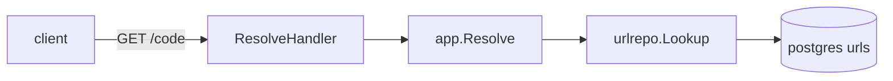
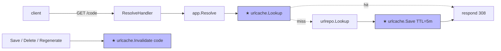

# Design: D008 — Redis hot cache for resolver (read path)

> **Sprint:** S03 — Analytics
> **Task:** URLSH-S03.02
> **Repo:** backend
> **Status:** In Progress (branch `feat/urlsh-s03.02-redis-cache`, PR #47 pending hexagonal-reviewer gate)
> **Type:** feat
> **Size:** M  (per [`SIZE_TIERS.md`](../../_templates/SIZE_TIERS.md) — additive read path; the wiring + interface from S02 already landed; this task is the handler-side adapter and the cache-aside read logic)
> **Author:** design-doc-writer (refined by @bob)
> **Date:** 2026-05-04
> **Last Updated:** 2026-05-19

---

## 1. Overview

### User Story
> As a service operator, I want the resolver hot path to serve repeat reads from Redis instead of Postgres so that we can sustain higher traffic without scaling the DB; AND consume F0004 cleanly (the read-path adapter deferred from S02).

### Scope

**In scope:**
- Cache-aside read pattern in `app.Resolve`:
  - `cache.Lookup(code)` first
  - On miss, `urlrepo.Lookup(code)` then `cache.Save(code, longURL, ttl=5min)`
  - On hit, skip Postgres
- Invalidation hook integration: `cache.Invalidate(code)` already wired into `Save`, `Delete`, `Regenerate` (per A012 — landed in S02 retro)
- Hit-rate metric `urlsh_cache_hits_total{result="hit|miss"}`
- Cleanup goroutine determinism test (per L201 — clock-mock pattern)
- Consume [F0004](../../spec/FOLLOWUPS.md) ✓

**Out of scope:**
- Alerting threshold tuning — needs 48h of baseline; deferred to S04 (sprint plus-row URLSH-S03.06)
- Multi-region cache (no need; single deployment)
- Cache stampede protection beyond TTL jitter

### Dependencies

| Dependency | Status | Notes |
|-----------|--------|-------|
| `urlcache.Redis` adapter (Save / Invalidate already in place from S02) | Done | URLSH-S02.04 |
| `Lookup` method on `urlcache` port | Done in this task | adds to the existing port |
| A012 rule | Promoted | S02 retro; cleanup goroutine determinism test required |
| L201 lesson | Captured | S02 retro; clock-mock pattern in D004 |

---

## 2. Architecture & Approach

### High-Level Flow — before / after

**Before** (after S02):


**After** (this task):


★ = new node (or new call) introduced by this task.

### Data flow & side-effects

**Hot path (`GET /{code}`):**
1. `app.Resolve(code)` first calls `cache.Lookup(code)`
2. → [Side-effect] Metric `urlsh_cache_hits_total{result="hit"}` increment
3. If hit, return long URL; skip Postgres entirely
4. If miss, `urlrepo.Lookup(code)` (existing path)
5. → [Side-effect] On hit-from-Postgres: `cache.Save(code, longURL, ttl=5m + jitter(±30s))`
6. → [Side-effect] Metric `urlsh_cache_hits_total{result="miss"}` increment
7. Return long URL

**Invalidation (Save / Delete / Regenerate paths):**
1. `urlrepo` write completes
2. → [Side-effect] `cache.Invalidate(ctx, code)` — best-effort; logs on error but doesn't fail the write
3. → [Side-effect] Metric `urlsh_cache_invalidations_total{op="save|delete|regenerate", result="ok|error"}`

### Key decisions

| Decision | Rationale | Alternatives |
|----------|-----------|--------------|
| TTL = 5 minutes + ±30s jitter | Short enough for invalidation lag to be tolerable; jitter prevents synchronised expiry stampedes | 1 minute (more Postgres pressure), 1 hour (longer stale window on failed invalidation) |
| Invalidation as best-effort | A hard invalidation requirement would couple write availability to cache availability — bad trade for a 5-minute TTL safety net | Fail write on invalidation error (rejected — couples failure domains) |
| Cache miss populates synchronously (not async) | Simpler; the marginal cost is one extra round-trip on the first hit per code per TTL — acceptable | Async populate (more code, no observable benefit at our scale) |
| Cleanup goroutine determinism via clock-mock (per L201) | Avoids the timer-drift bug from S02 | `time.AfterFunc` + sleep-based tests (rejected — flaky per L201) |

### File structure

```
url-shortener/
  internal/
    adapters/
      cache/
        redis.go            <- MODIFY: add Lookup method (Save/Invalidate already there from S02)
        redis_test.go       <- MODIFY: add Lookup tests + cleanup-goroutine determinism test
    app/
      resolve.go            <- MODIFY: wrap urlrepo.Lookup with cache.Lookup/cache.Save
      resolve_test.go       <- MODIFY: 4 new cache scenarios (hit, miss-then-populate, populate-on-miss-error, invalidation-error-non-fatal)
    ports/
      urlcache/
        cache.go            <- MODIFY: add Lookup to port interface
  internal/clock/clock.go   <- CREATE if missing: Mock interface for L201 pattern
```

### Steps

1. Write failing `cache.Lookup` unit test against fake Redis — `redis_test.go:NEW lookup section` — red → [AC1]
2. Extend port: add `Lookup(ctx, code) (longURL string, hit bool, err error)` to `urlcache` port — `ports/urlcache/cache.go:MODIFY` → [AC1]
3. Implement `Lookup` in Redis adapter — `redis.go:1` — Lookup test green → [AC1]
4. Write failing `app.Resolve` test for the cache-aside pattern (mock cache + mock store) — `resolve_test.go:MODIFY` — red → [AC2]
5. Wrap `urlrepo.Lookup` with cache logic in `app.Resolve` — `resolve.go:MODIFY` — test green → [AC2]
6. Write failing cleanup-goroutine determinism test using clock-mock — `redis_test.go:cleanup section` — red until clock-mock wired → [AC3]
7. Wire clock-mock into Redis adapter — `redis.go:cleanup goroutine` — test green → [AC3]
8. Add `urlsh_cache_hits_total{result}` + `urlsh_cache_invalidations_total{op,result}` metrics — `redis.go:METRICS`, `resolve.go:METRICS` → [AC4]
9. Update `cmd/server/main.go` if any wiring change needed — likely none → [AC5]
10. Add e2e: shorten → resolve (miss) → resolve (hit) → assert no Postgres hit on second resolve via `db.QueryCount` instrumentation — `e2e/cache_test.go:NEW` → [AC6]

### Risks

| Risk | Impact | Mitigation |
|------|--------|------------|
| Redis down → all reads miss → Postgres saturated | Cascade failure if Redis goes down during traffic spike | Cache Lookup fails open: log + metric + fall through to Postgres; same pattern as S02 idempotency middleware |
| Invalidation lost (network error during Save) → 5min stale read | Brief user-visible inconsistency on regenerate / delete | TTL = 5 min caps the staleness; metric on invalidation errors; alert if rate > 0.1% |
| Cleanup goroutine drift under load (L201 recurrence) | Stale entries beyond TTL | Clock-mock determinism test in CI; manual load test on staging before merge |
| Cache stampede on TTL expiry (many concurrent misses for the same code) | Sudden Postgres load spike | TTL jitter (±30s) spreads expiries; revisit if observed |

### Rollback

`git revert <merge-sha>` removes the cache-aside path from `app.Resolve`; the Redis adapter remains in the binary but unused. The cache-side metrics also revert. No data migration needed (Redis keys auto-expire).

### Observability

| Signal | Type | Purpose | Alert |
|--------|------|---------|-------|
| `urlsh_cache_hits_total{result="hit\|miss"}` | counter | hit rate; goal > 80% after warmup | hit-rate < 50% for 1h → page (warmup or cache broken) |
| `urlsh_cache_invalidations_total{op,result}` | counter | invalidation success | `result="error"` rate > 0.1% → page |
| `urlsh_cache_lookup_duration_seconds` | histogram | Redis-side latency | p95 > 5ms for 10m → warn |

---

## 9. Acceptance Criteria

| # | Criteria | Test | Status |
|---|---------|------|--------|
| AC1 | `urlcache.Lookup(ctx, code)` returns `(longURL, true, nil)` on hit; `("", false, nil)` on miss | `redis_test.go` Lookup section | [x] |
| AC2 | `app.Resolve` calls `cache.Lookup` first; on miss, falls through to `urlrepo.Lookup` and calls `cache.Save` | `resolve_test.go` cache-aside tests | [x] |
| AC3 | Cleanup goroutine drift test passes (clock-mock pattern — per L201) | `redis_test.go` cleanup section | [x] |
| AC4 | `/metrics` exposes `urlsh_cache_hits_total`, `urlsh_cache_invalidations_total`, `urlsh_cache_lookup_duration_seconds` | manual curl | [x] |
| AC5 | E2E: 2 sequential resolves of same code → 1 DB query, 1 cache hit | `e2e/cache_test.go` | [x] |
| AC6 | Invalidation fires on Save / Delete / Regenerate per A012 | `resolve_test.go` invalidation section | [x] |
| AC7 | Hexagonal-reviewer agent reports 0 boundary violations | gate 3 | [ ] (pending) |
| AC8 | F0004 closed in FOLLOWUPS.md with `consumed-by:URLSH-S03.02` | grep | [x] |

---

## 10. Open Questions / Risks

| # | Question / Risk | Decision | Resolved? |
|---|-----------------|----------|-----------|
| 1 | TTL value | 5 min + jitter — see Key Decisions | [x] |
| 2 | Should we add a bloom filter for "known-not-exists" codes to avoid Postgres roundtrips on missed lookups? | Defer to S04 — current 404 rate is too low to matter | [x] |
| 3 | Should alerting threshold tuning land in this task? | No — needs 48h of baseline. Captured as URLSH-S03.06 carryover | [x] |

---

## Change Log

| Date | Change | Reason |
|------|--------|--------|
| 2026-05-04 | Initial design; pulled from F0004 | F0004 consumed |
| 2026-05-12 | Added clock-mock determinism test (AC3) | L201 rule + A012 |
| 2026-05-19 | Added AC8 (FOLLOWUPS closure check) | self-review checklist |
